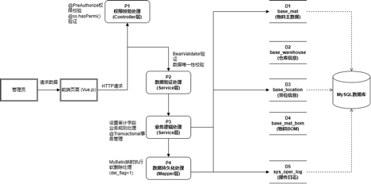
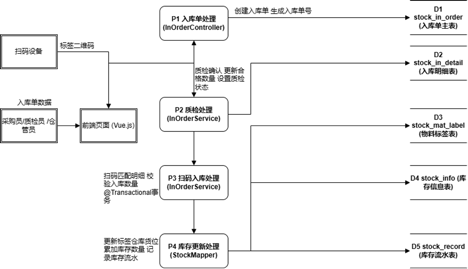
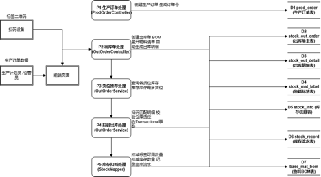
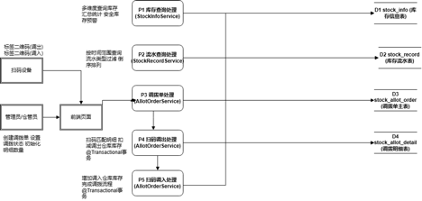

## 第1章 绪论

### 1.1 选题的背景
　　仓储管理作为制造业供应链管理的核心环节，直接关系到企业的生产效率、成本控制与产品质量保障。随着全球制造业向智能化、数字化方向深度转型，仓储管理系统（Warehouse Management System，WMS）已从传统的人工记账模式逐步演进为以信息技术为支撑的数字化管理平台。据相关统计数据显示，仓储管理成本占我国社会物流总费用的比重约为33%，仓储管理效率的提升对于降低企业运营成本具有显著意义。因此，构建面向特定行业的专业化仓储管理系统，已成为制造业信息化建设的重要研究方向。

　　具体而言，玻璃作为建筑、汽车、电子、光伏等行业不可或缺的基础材料，其市场需求随着下游产业的快速发展而持续增长。玻璃生产具有高温连续作业、原料配比精度要求高、产品规格多样化等显著特征，其生产过程涵盖原料配料、熔化、成型、退火、切割、深加工等多个工序环节，每个环节均涉及大量物料的出入库操作与库存管理。与此同时，石英砂、纯碱、石灰石等原料易受潮结块，玻璃原片易碎且规格繁多，成品需按厚度、尺寸、透光等级等参数进行精细分类管理。上述行业特性对仓储管理的精细化程度和实时响应能力提出了极高的要求。

　　从政策层面来看，在国家"中国制造2025"战略和"工业互联网"政策的引导下，制造业数字化转型已成为不可逆转的发展趋势。然而，当前我国玻璃生产企业的仓储管理信息化水平普遍偏低，大量中小型玻璃企业仍然依赖人工台账、Excel电子表格与纸质单据相结合的传统管理模式，导致库存数据更新滞后、物料批次追溯困难、库存预警机制缺失等问题长期存在。现有的通用型ERP系统虽然在一定程度上实现了基础库存管理功能，但未能有效整合原料管理、生产领料、成品入库、库存追溯等核心业务环节，与玻璃行业的实际需求之间存在明显的适配性不足。综上所述，设计并实现一套面向玻璃生产企业的一体化仓储管理系统，对于推动玻璃行业仓储管理的信息化升级具有重要的现实意义。

### 1.2 选题目的和意义
　　本研究的核心目的在于设计并实现一套基于Spring Boot框架的玻璃生产仓储管理系统，针对当前玻璃生产企业在仓储管理环节面临的信息孤岛、流程割裂与管理效率低下等突出问题，构建一个集物料管理、入库管理、出库管理、库存管理、调拨管理与统计分析功能于一体的数字化管理平台，从而实现从原料采购入库到成品出库的全流程信息化管控。

　　就现实需求而言，当前玻璃生产行业正逐步迈向规模化与智能化发展阶段，现代化玻璃企业普遍采用自动化配料、连续熔化、精准退火等先进生产工艺。然而，在仓储管理方面，企业完成一次原料入库往往需要经历"采购下单—到货检验—手工登记—Excel录入—仓库分配"等多个环节，仓管员需在ERP系统、Excel电子表格与纸质单据之间频繁切换，极易产生人为失误，造成库存数据不准确、物料追溯链路断裂等问题。因此，本研究旨在通过系统化的技术方案，将分散的业务流程整合至统一平台，从根本上消除信息传递的断层与冗余。

　　从理论层面而言，本研究将前后端分离架构与仓储管理领域的业务需求相结合，探索了Spring Boot与Vue.js技术栈在制造业仓储管理场景中的应用模式；同时针对玻璃生产行业的特殊需求，提出了基于物料标签与二维码扫码的全流程追溯机制，以及基于BOM（Bill of Materials）自动展开的领料清单生成机制与货位智能推荐算法。从实践层面而言，系统通过整合采购入库、生产领料、库存盘点、物料调拨等核心业务流程，能够有效消除信息孤岛现象；通过物料标签管理与批次追溯功能实现全流程质量追溯；通过库存预警机制与统计分析功能辅助管理决策。此外，本系统采用低成本、易部署的技术架构，能够为中小型玻璃生产企业提供一套实施门槛低、操作便捷的仓储管理数字化解决方案。

### 1.3 国内外研究现状

　　仓储管理系统作为现代供应链管理的关键组成部分，长期以来受到国内外学术界与产业界的广泛关注。随着物联网、云计算、大数据等新一代信息技术的快速发展，仓储管理系统的研究与应用不断深入，系统功能从传统的库存记录逐步拓展至智能决策支持、全流程追溯与多维度数据分析等领域。

　　在系统架构与技术框架方面，国外学者起步较早。Richards等在其研究中指出基于微服务架构的WMS系统在可扩展性与模块独立部署方面具有显著优势；Faber等提出了基于多目标优化算法的货位分配策略，为货位推荐功能的智能化设计提供了理论基础。在物联网技术应用方面，Zhu等提出了融合RFID标签与二维码的双重标识方案，研究表明该方案可将出入库操作效率提升约40%；Gu等提出了基于传感器网络的实时库存监控方案，但上述技术方案实施成本较高，对中小型企业而言经济可行性仍存在局限。国内方面，张明华等基于Spring Boot与MyBatis框架实现了面向制造企业的仓储管理系统，验证了Spring Boot框架在中小型WMS开发中的适用性，但功能局限于基础出入库管理；李伟等提出了"一物一码"的二维码标签管理方案，实现了物料全流程追溯，但缺乏与出入库业务流程的深度集成；赵国强等基于若依（RuoYi）开源框架开发了面向中小型制造企业的生产管理系统，验证了开源框架快速开发的可行性，但在仓储管理功能的深度与完整性方面仍有提升空间。

　　在商业化软件方面，国际市场上以SAP WM、Oracle WMS等为代表的大型WMS系统功能较为完善，但普遍存在实施成本高昂、定制化周期较长等不足，且缺乏对中国玻璃生产行业特殊需求的适配支持。国内以用友U8、金蝶K/3等为代表的ERP系统在仓储管理领域占据较大市场份额，但二次开发成本高、操作界面复杂、库存预警与生产排程的联动机制不够完善等问题仍然突出。近年来涌现的旺店通、聚水潭等SaaS化仓储管理平台则以电商场景为主，在制造业领域的功能覆盖度与行业适配性方面仍显不足。

　　综合以上分析，现有研究与商业化系统仍存在以下共性不足：其一，行业适配性不足，缺乏对玻璃生产行业特有需求的深度适配；其二，功能完整性不足，未能实现从基础数据管理到统计分析的完整业务闭环；其三，实施门槛偏高，中小型企业难以负担高昂的系统采购与定制开发费用；其四，生产协同能力不足，缺乏与生产订单管理、BOM管理等环节的深度协同。基于上述分析，本研究以玻璃生产企业的仓储管理需求为切入点，设计并实现一套功能完整、行业适配、实施门槛低的仓储管理系统，旨在填补现有系统在玻璃行业适配性与中小企业普及性方面的空白。

### 1.4 本文开发内容

　　本文面向玻璃生产企业的仓储管理需求，采用前后端分离的开发模式，基于Vue.js与Spring Boot框架设计并实现一套仓储管理系统。系统整体划分为前台业务管理系统与后台系统管理两大部分，涵盖基础数据管理、采购管理、生产管理、库存管理、调拨管理与统计分析六大核心业务模块。

　　首先，系统构建了完整的基础数据管理体系，涵盖物料信息、物料BOM、物料分类、仓库、货位、供应商与车间管理等功能，为上层业务提供统一的主数据支撑。其次，系统围绕采购入库业务，实现了入库单管理、入库退货管理与物料标签管理功能，支持扫码入库操作，入库完成后自动生成物料标签并同步更新库存数据。再次，系统围绕生产领料业务，实现了生产订单管理、领料出库管理与出库退货管理功能，支持根据生产订单自动展开BOM生成领料清单，并提供货位智能推荐与扫码出库功能。此外，系统实现了库存信息查询、库存流水查询与库存预警功能。与此同时，系统提供了调拨单管理与扫码调拨功能，支持物料的跨仓库转移。最后，系统实现了入库统计、出库统计与库存流水统计功能，支持多维度统计分析与可视化报表生成。后台系统管理面向系统管理员，基于RBAC权限模型提供用户管理、角色管理、权限管理、字典管理、操作日志等功能，保障系统运行的安全性与可控性。

### 1.5 本章小结

　　本章作为全文的引论部分，从选题背景、选题目的与意义、国内外研究现状以及本文开发内容四个方面对研究工作进行了系统阐述。首先，分析了仓储管理在制造业供应链中的核心地位以及玻璃生产行业对仓储管理的特殊需求，指出了当前中小型玻璃企业仓储管理信息化水平偏低的现实问题。其次，明确了本研究的核心目的与理论及实践意义。再次，通过对国内外研究成果与商业化软件的综述，总结了现有系统在行业适配性、功能完整性、实施门槛与生产协同能力等方面的不足，明确了本研究的切入点。最后，概述了系统的整体功能架构与开发内容。下一章将对系统的功能需求进行详细分析，建立用例模型，明确系统的功能边界与业务流程，为第三章的系统设计提供需求依据。

---

## 第2章 系统需求分析

### 2.1 系统功能需求分析
本系统面向玻璃生产管理场景下的仓储与库存流转需求，重点实现从基础数据维护到库存业务闭环的数字化管理。结合系统数据库表结构与业务模块划分，系统功能需求可归纳为以下几类：基础数据管理、入库业务、入库退货、出库业务、出库退货、库存调拨、物料标签管理与扫码作业、库存信息与库存流水查询、生产订单关联、系统权限控制与操作审计、统计监控。

---

### 2.2 系统功能需求表
面向不同角色的操作需求，本系统的主要功能需求如表2-1所示。系统功能按业务领域划分为六大类共20项功能点：基础数据管理类（编号1-1至1-8）涵盖物料、仓库、货位、供应商、车间等主数据的维护，为上层业务提供统一的数据基础；采购入库类（编号2-1至2-3）覆盖入库单创建、入库退货与物料标签生成的完整入库流程；生产出库类（编号3-1至3-3）覆盖生产订单管理、领料出库与出库退货的完整出库流程；库存管理类（编号4-1至4-2）实现库存信息实时查询与库存流水审计追溯；调拨管理类（编号5-1）支持物料跨仓库调拨的全流程管控；统计分析类（编号6-1至6-3）提供出入库与库存流水的多维度统计报表，辅助管理决策。

**表2-1 主要功能需求一览表**

| 功能编号 | 功能名称 | 功能说明 |
|---|---|---|
| 1-1 | 物料信息管理 | 管理物料编码、名称、规格型号、单位、分类、安全库存等信息，支持物料分类管理与版本追溯 |
| 1-2 | 物料BOM管理 | 记录物料组成关系及用量配比，支持BOM的创建、修改与版本控制 |
| 1-3 | 物料分类管理 | 维护物料分类信息，实现物料的分级分类管理 |
| 1-4 | 物料组别管理 | 维护物料组别信息，支持物料按组别归类管理与查询 |
| 1-5 | 仓库管理 | 维护仓库基本信息、存储区域划分、仓库属性等 |
| 1-6 | 货位管理 | 维护货位编号信息，关联仓库与货位，支持货位状态实时更新 |
| 1-7 | 供应商管理 | 维护供应商基本信息、合作历史、供货质量评级，支持资质审核 |
| 1-8 | 车间管理 | 维护车间基本信息，划分生产车间区域 |
| 2-1 | 入库单管理 | 支持入库单创建、审批与入库确认，记录入库时间、仓库、货位、数量及供应商信息 |
| 2-2 | 入库退货管理 | 支持已入库物料退货操作，记录退货原因、退货数量、退货时间等信息 |
| 2-3 | 物料标签管理 | 入库时自动生成物料标签，支持标签打印与扫码操作 |
| 3-1 | 生产订单管理 | 记录产品类型、规格、数量、交付日期等信息，支持订单审核、修改、取消及状态跟踪 |
| 3-2 | 出库单管理 | 根据生产订单生成出库单，记录出库时间、经办人、领料车间，自动扣减库存 |
| 3-3 | 出库退货管理 | 支持已出库物料退货操作，记录退货原因、退货数量、退货时间等信息 |
| 4-1 | 库存信息管理 | 记录物料库存数量，自动更新库存余量，设置库存预警阈值 |
| 4-2 | 库存流水管理 | 记录物料出入库流水明细，支持按物料、仓库、时间段等多维度查询 |
| 5-1 | 调拨单管理 | 支持调拨单创建、审批与调拨确认，记录调出仓库、调入仓库、调拨物料及数量 |
| 6-1 | 入库统计 | 按时间段、供应商、仓库、物料等维度统计入库情况，生成入库统计报表 |
| 6-2 | 出库统计 | 按时间段、车间、仓库、物料等维度统计出库情况，生成出库统计报表 |
| 6-3 | 库存流水统计 | 记录库存变动明细，支持按物料、仓库、时间段等维度查询 |

> 注：你原文中部分单元格有“录/录物/录物料”等疑似排版断行造成的字样，我已尽量按语义补齐。

---

### 2.3 系统用例模型分析
本系统的用例设计围绕仓储管理的核心业务流程展开，整体以“基础数据支撑、采购入库驱动、出库领料消耗、调拨灵活调度、库存实时管控、统计闭环分析”为主线。基于系统的角色划分与功能定位，将用例图按系统总体用例、业务员用例、管理员用例三个维度分别展示，如图2-1、图2-2、图2-3所示。

---

#### 2.3.1 系统总体用例分析
图2-1为系统总体用例图。该图从全局视角展示了管理员、采购员、计划员、仓管员四个角色与系统七大功能模块之间的参与关系。管理员负责基础数据管理、系统管理和统计报表三个模块，承担系统配置与数据维护的职责；采购员参与采购入库管理和基础数据管理，负责物料采购与供应商信息的维护；计划员参与出库管理、调拨管理和统计报表，负责生产计划的制定与出库调度；仓管员参与采购入库管理、库存管理和调拨管理，负责仓库现场的收发货与库存盘点。四个角色各司其职、协同配合，共同覆盖了仓储管理从数据准备到业务执行再到统计分析的完整链路。

（此处对应：图2-1 总体用例图）

---

#### 2.3.2 核心业务用例模型
图2-2为业务员用例图，细化了采购员、仓管员、计划员三个业务角色的具体操作用例及其关联关系。采购员负责入库单管理、入库退货和物料标签管理，是采购入库流程的发起者；仓管员负责入库质检、入库退货、出库退货、调拨单管理、库存查询和库存流水查询，是仓库现场操作的核心执行者；计划员负责生产订单管理、领料出库、销售出库、调拨单管理和统计分析，是出库与调拨业务的计划制定者。

在用例关系方面，入库单的处理流程中必须包含入库质检环节以确保物料质量合格，同时入库完成后需生成物料标签用于后续出库扫码与库存追溯，因此入库单管理以include关系分别包含入库质检和物料标签管理；领料出库必须基于已有的生产订单才能发起，因此领料出库以include关系包含生产订单管理。此外，入库退货和调拨单管理作为采购员与仓管员、仓管员与计划员之间的共享用例，体现了不同角色在同一业务环节中的协作关系。

（此处对应：图2-2 业务员用例图）

---

#### 2.3.3 管理员用例模型
图2-3为管理员用例图，展示了管理员角色在系统中承担的基础数据维护、系统配置与运维监控等职责。

在基础数据层面，管理员负责物料管理、仓库与货位管理、供应商管理和车间管理，为业务系统提供完整的主数据支撑；在系统管理层面，管理员负责用户与角色管理、字典与参数配置，其中用户与角色的分配必须依托菜单与权限体系才能生效，因此用户与角色管理以include关系包含菜单与权限配置；在系统监控层面，管理员通过日志管理和服务与缓存监控掌握系统运行状态，及时发现并处理异常；在统计报表层面，管理员通过仪表盘和出入库统计从全局视角监控业务运营指标，为管理决策提供数据依据。

（此处对应：图2-3 管理员用例图）

---

### 2.4 系统数据流图分析

　　数据流图（Data Flow Diagram，DFD）是结构化分析方法中描述系统数据流动与加工过程的重要工具，能够直观地展示系统中数据的来源、去向、存储与处理逻辑。本节针对系统的四个核心业务模块，分别绘制数据流图，从数据流转的角度对系统需求进行深入分析。

#### 2.4.1 基础数据管理模块数据流图

　　图2-4展示了基础数据管理模块的数据流动与加工关系。管理员作为外部实体，通过前端页面发起数据操作请求。请求数据首先流入P1权限校验处理过程，P1通过权限注解验证用户操作权限，校验通过后将请求数据传递至P2数据验证处理过程。P2执行后端数据验证，检查数据的完整性与唯一性约束，验证通过后将实体对象传递至P3业务逻辑处理过程。P3负责设置审计字段、处理业务规则并记录操作日志，随后将数据写入base_mat（物料表）、base_warehouse（仓库表）、base_location（货位表）、base_mat_bom（物料BOM表）等数据存储。查询操作时，数据从数据存储逐层返回至管理员；新增与修改操作时，数据从管理员逐层传递至数据存储完成持久化。

（此处对应：图2-4 基础数据管理模块数据流图）

#### 2.4.2 入库管理模块数据流图

　　图2-5展示了入库管理模块的数据流动与加工关系。该模块涉及采购员、质检员与仓管员三个外部实体，以及扫码设备作为数据输入源。采购员或仓管员通过前端页面发起入库单创建请求，请求数据流入P1入库单处理过程，P1生成入库单号，设置订单状态为"已创建"、质检状态为"未质检"，将入库单数据写入stock_in_order表和stock_in_detail表，同时关联物料标签。质检员提交质检结果后，质检数据流入P2质检处理过程，P2更新入库明细的合格数量与入库单的质检状态。仓管员使用扫码设备扫描入库单二维码后，扫码数据流入P3扫码入库处理过程，P3开启数据库事务，调用库存更新逻辑：更新stock_mat_label表的可用数量，查询并更新stock_info表的库存记录（存在则累加，不存在则新增），向stock_record表插入入库流水记录，最后更新入库单状态为"已入库"。

（此处对应：图2-5 入库管理模块数据流图）

#### 2.4.3 出库管理模块数据流图

　　图2-6展示了出库管理模块的数据流动与加工关系。该模块涉及生产计划员与仓管员两个外部实体。生产计划员创建生产订单，订单数据流入P1生产订单处理过程，P1生成订单号并将数据写入prod_order表。计划员基于生产订单创建出库单，出库单数据流入P2出库单处理过程，P2从prod_order表查询产品信息，从base_mat_bom表查询BOM清单并展开物料清单，自动生成出库明细，将数据写入stock_out_order表和stock_out_detail表。仓管员进入出库单详情页面时，货位推荐请求流入P3货位推荐处理过程，P3从stock_info表查询各货位库存分布，选择库存最多的货位作为推荐货位返回。扫码完成后，扫码数据流入P4扫码出库处理过程，P4开启事务，从stock_mat_label表扣减可用数量，从stock_info表扣减库存数量，向stock_record表插入出库流水记录，更新stock_out_detail表的已出库数量，最后根据完成情况更新出库单状态。

（此处对应：图2-6 出库管理模块数据流图）

#### 2.4.4 库存管理与调拨模块数据流图

　　图2-7展示了库存管理与调拨模块的数据流动与加工关系。该模块涉及管理员与仓管员两个外部实体。管理员发起库存查询请求，请求数据流入P1库存查询处理过程，P1从stock_info表查询库存数据，支持按物料、仓库、货位等多维度查询与汇总统计，库存低于安全库存阈值时触发预警标识。管理员发起流水查询请求，请求数据流入P2流水查询处理过程，P2从stock_record表按时间范围与流水类型过滤查询。仓管员创建调拨单，调拨单数据流入P3调拨单处理过程，P3生成调拨单号，将数据写入stock_allot_order表和stock_allot_detail表。调拨业务分为调出与调入两个阶段：扫码调出数据流入P4扫码调出处理过程，P4扣减stock_info表中调出仓库的库存，向stock_record表插入调拨出库流水，更新调拨进度为"已调出"；扫码调入数据流入P5扫码调入处理过程，P5增加stock_info表中调入仓库的库存，向stock_record表插入调拨入库流水，更新调拨进度为"已调入"、调拨状态为"已完成"。

（此处对应：图2-7 库存管理与调拨模块数据流图）

---

### 2.5 系统原型
　　系统原型展示关键业务页面的布局与信息组织方式。本系统采用左侧导航栏与右侧内容区的经典布局结构进行开发，主要包含登录页、首页统计页、入库单列表与新增页、出库单列表与新增页、调拨单列表页、库存信息查询页、库存流水查询页、物料标签管理页等核心业务页面。

（此处对应：图2-8 后台管理系统主界面原型图）

---

### 2.6 本章小结
　　本章完成了玻璃生产管理场景下系统的功能需求分析，给出了主要功能需求表，并从用户角色角度建立了用例模型。在此基础上，通过数据流图对系统四个核心业务模块的数据流动与加工逻辑进行了系统化分析，明确了各模块涉及的外部实体、处理过程与数据存储之间的关系。最后，通过系统原型展示了关键业务页面的布局设计。需求层面重点覆盖基础数据管理、库存出入库与退货、调拨、标签扫码追溯、库存信息与流水审计、生产订单关联、权限控制与统计监控。上述内容为第三章系统总体设计、数据库建模与后续实现提供依据。

---