# 第6章 系统测试

本章将对仓库管理系统中的核心功能模块开展测试验证，确保功能与预期一致。测试重点包括基础数据管理、入库管理、出库管理及库存管理与调拨四大核心功能模块。测试工作采用模块化测试方法，通过设计测试用例，模拟真实用户的操作场景，对前面章节提到的物料信息管理、入库单管理、出库单管理、库存信息管理及库存调拨等系统功能进行逐项验证。测试过程中将严格遵循用户实际业务流程，将实际运行结果与系统需求预期效果进行比对分析，确保各功能模块的正确性、可靠性和易用性。测试结果将通过测试用例表记录和界面操作截图呈现，全面展示系统的功能实现情况。

## 6.1 基础数据管理模块测试

基础数据管理模块是系统的基础支撑模块，主要包括物料信息管理、物料BOM管理、仓库管理和货位管理等功能。本节将对这些核心功能进行详细测试。

### 6.1.1 物料信息管理功能测试

管理员登录系统后，进入基础数据管理模块，点击物料管理菜单，进入物料信息列表页面。管理员可以新增物料信息，填写物料编码、物料名称、规格型号、计量单位、物料分类、物料组、安全库存等基本信息，点击确认后系统保存物料数据并刷新列表。

| 操作步骤 | 操作描述 | 预期现象 | 测试结果 | 是否通过 |
|---------|---------|---------|---------|---------|
| 1 | 管理员点击基础数据-物料管理，点击新增物料按钮 | 弹出物料信息表单对话框 | 与预期一致 | 通过 |
| 2 | 填写物料信息并点击确认： 物料编码：MAT20240101 物料名称：304不锈钢板 规格型号：1000×2000×3mm 计量单位：张 物料分类：原材料-金属材料 安全库存：100 | 系统提示"新增成功"，物料列表刷新并显示新增记录 | 与预期一致 | 通过 |
| 3 | 在列表中查看新增物料 | 物料信息显示完整，包括编码、名称、规格型号、单位、分类等 | 与预期一致 | 通过 |

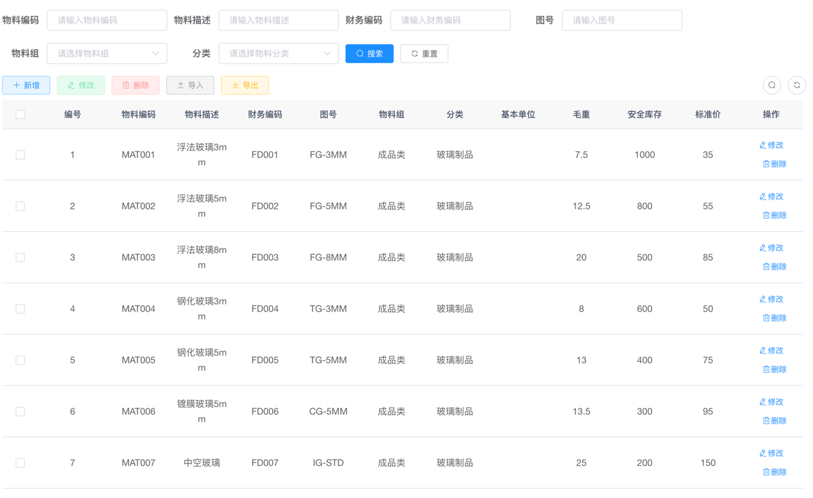
**【图6-1 物料管理列表页面】**
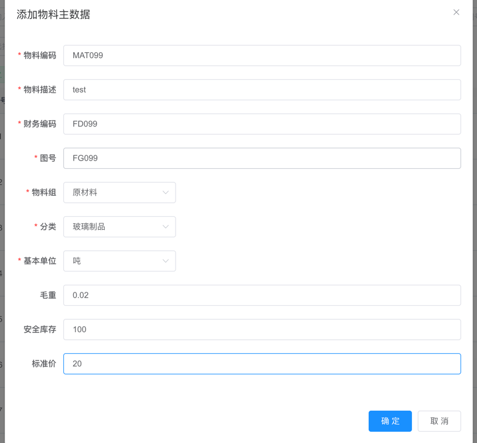
**【图6-2 新增物料信息表单】**

**【图6-3 物料新增成功并显示】**

### 6.1.2 物料BOM管理功能测试

管理员进入物料BOM管理界面，选择父物料后可以查看该物料的BOM结构，即该物料由哪些子物料组成。管理员可以新增BOM关系，选择子物料并填写用量，系统会自动检查循环依赖和重复关系，验证通过后保存BOM数据。

| 操作步骤 | 操作描述 | 预期现象 | 测试结果 | 是否通过 |
|---------|---------|---------|---------|---------|
| 1 | 管理员点击基础数据-物料BOM管理，选择父物料"装配件A" | 系统显示该父物料的BOM列表 | 与预期一致 | 通过 |
| 2 | 点击新增BOM按钮，填写BOM信息并确认： 子物料：MAT20240101（304不锈钢板） 用量：2.5 | 系统执行循环依赖和重复关系检查，验证通过后提示"新增成功"，BOM列表刷新 | 与预期一致 | 通过 |
| 3 | 尝试再次添加相同的子物料 | 系统提示"该BOM关系已存在，请勿重复添加" | 与预期一致 | 通过 |
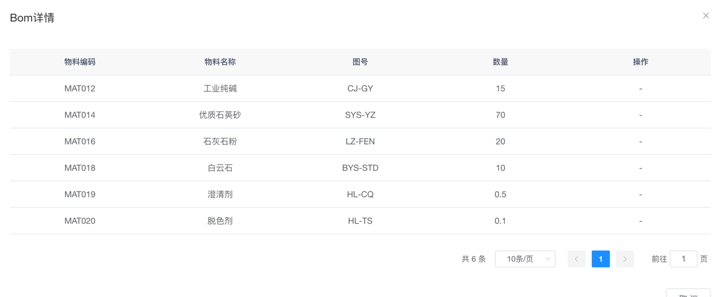
**【图6-4 物料BOM管理页面】**
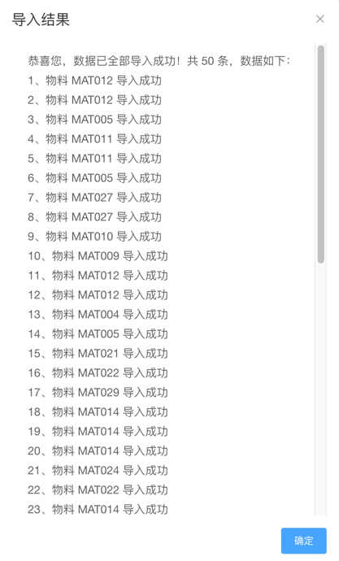
**【图6-5 导入bom并成功】**
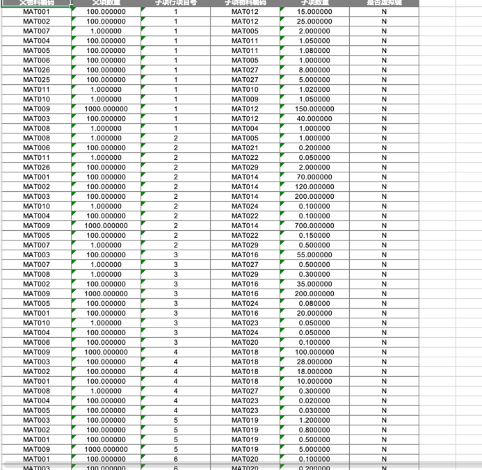
**【图6-6 导出BOM】**

### 6.1.3 仓库货位管理功能测试

管理员进入仓库货位管理界面，可以管理仓库和货位信息。在仓库管理中，管理员可以新增仓库，填写仓库编码、名称、类型、负责人等信息。在货位管理中，管理员选择所属仓库后，可以新增货位并填写货位编码、名称等信息。系统支持打印仓库和货位标签，生成包含二维码的PDF文件供现场使用。

| 操作步骤 | 操作描述 | 预期现象 | 测试结果 | 是否通过 |
|---------|---------|---------|---------|---------|
| 1 | 管理员点击基础数据-仓库管理，点击新增并填写仓库信息： 仓库编码：WH001 仓库名称：原材料仓库 仓库类型：原材料仓 负责人：张三 | 系统提示"新增成功"，仓库列表显示新增记录 | 与预期一致 | 通过 |
| 2 | 点击基础数据-货位管理，选择仓库"WH001" | 系统显示该仓库下的货位列表 | 与预期一致 | 通过 |
| 3 | 点击新增货位并填写信息： 货位编码：A01-001 货位名称：A区1排1号 | 系统提示"新增成功"，货位列表显示新增记录 | 与预期一致 | 通过 |
| 4 | 选择货位并点击打印标签按钮 | 系统生成包含货位信息和二维码的PDF文件并下载 | 与预期一致 | 通过 |
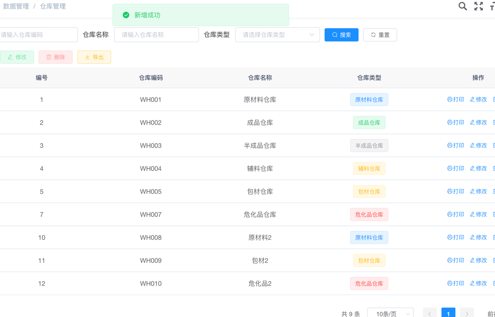
**【图6-7 新增仓库成功】**
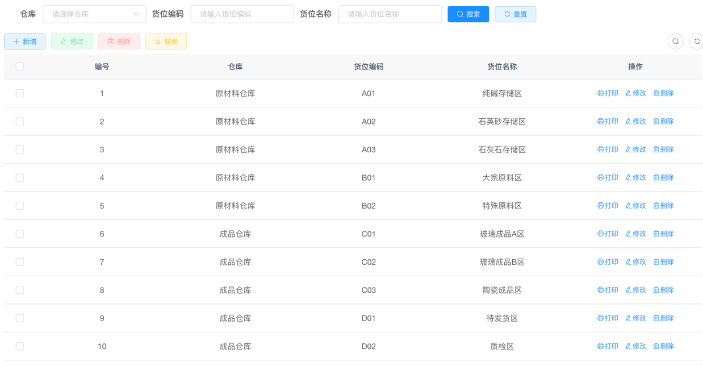
**【图6-8 货位管理页面】**
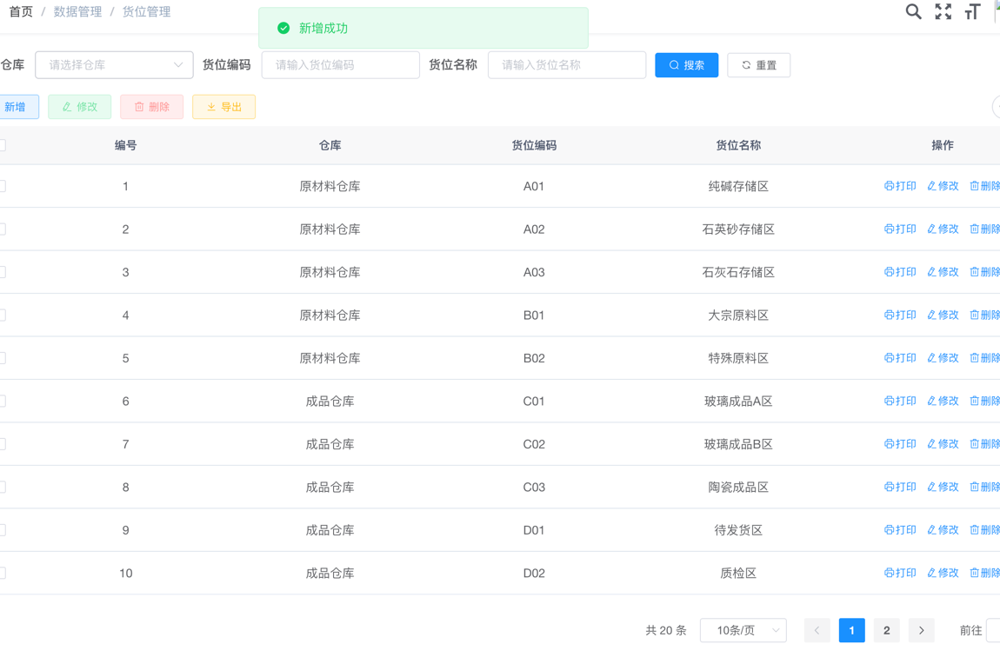
**【图6-9 新增货位成功】**
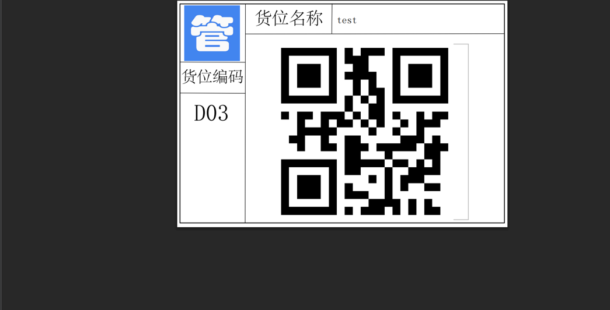
**【图6-10 货位标签PDF预览】**

## 6.2 入库管理模块测试

入库管理模块负责处理采购入库和生产退料入库业务，包括入库单管理、入库单确认、物料标签生成与打印等功能。本节将对入库业务流程进行详细测试。

### 6.2.1 采购入库单管理功能测试

采购员登录系统后，进入采购管理模块，点击采购入库菜单，可以新增采购入库单。采购员填写供应商、入库类型、入库明细等信息，保存后生成入库单。仓库管理员确认入库单后，系统自动生成物料标签并更新库存数据。

| 操作步骤 | 操作描述 | 预期现象 | 测试结果 | 是否通过 |
|---------|---------|---------|---------|---------|
| 1 | 采购员点击采购管理-采购入库，点击新增并填写入库单信息： 供应商：北京钢材供应商 入库类型：采购入库 物料：MAT20240101 计划数量：100 目标仓库：WH001 目标货位：A01-001 | 系统提示"保存成功"，入库单状态为"待入库" | 与预期一致 | 通过 |
| 2 | 仓库管理员点击确认入库按钮，填写实际入库数量并确认 | 系统提示"入库成功"，入库单状态变更为"已入库"，自动生成物料标签 | 与预期一致 | 通过 |
| 3 | 点击打印标签按钮 | 系统生成包含物料标签和二维码的PDF文件并下载 | 与预期一致 | 通过 |
| 4 | 进入库存管理-库存信息查询 | 该物料库存数量已增加100张 | 与预期一致 | 通过 |
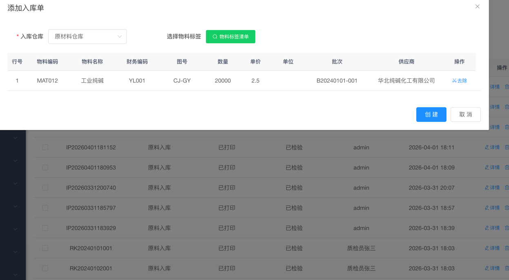
**【图6-11 新增采购入库单】**
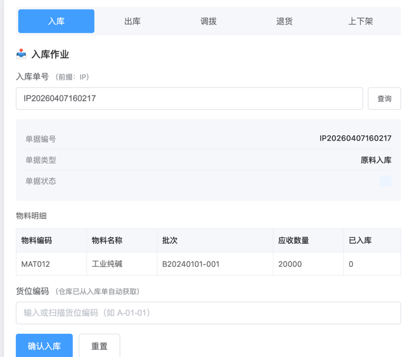
**【图6-12 确认入库成功】**
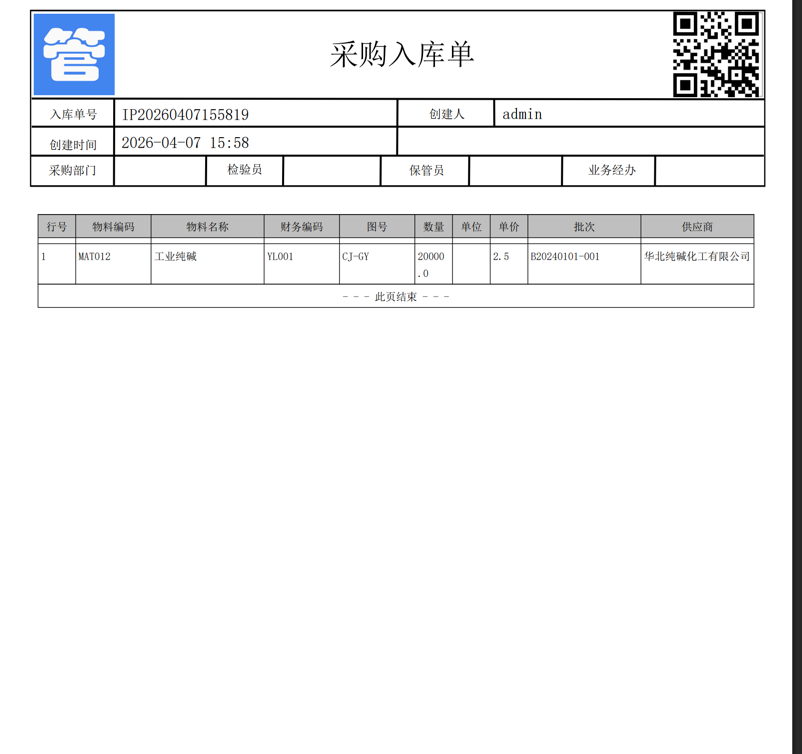
**【图6-13 入库单PDF预览】**

### 6.2.2 入库质检确认功能测试

质检员登录系统后，进入采购管理模块，查看待质检的入库单。质检员对入库物料进行质量检验，填写合格数量，系统更新入库单的质检状态。质检通过后，仓管员方可进行扫码入库操作。

| 操作步骤 | 操作描述 | 预期现象 | 测试结果 | 是否通过 |
|---------|---------|---------|---------|---------|
| 1 | 质检员点击采购管理-采购入库，查看待质检入库单 | 入库单列表显示质检状态为"未质检"的记录 | 与预期一致 | 通过 |
| 2 | 点击质检按钮，填写合格数量并确认： 物料：MAT20240101 入库数量：100 合格数量：98 | 系统提示"质检完成"，入库单质检状态变更为"已质检"，合格数量更新为98 | 与预期一致 | 通过 |
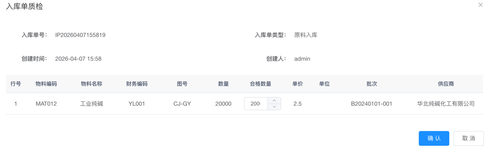
**【图6-14 入库单质检操作】**

**【图6-15 质检完成状态更新】**

## 6.3 出库管理模块测试

出库管理模块负责处理生产领料出库业务，包括出库单管理、BOM自动展开、货位推荐、扫码出库确认及库存扣减等功能。本节将对出库业务流程进行详细测试。

### 6.3.1 生产领料出库功能测试

生产管理员根据生产订单创建生产领料出库单，选择生产订单后系统自动根据BOM展开计算所需物料及数量。生产管理员确认领料清单后保存出库单，仓库管理员确认出库后，系统扣减库存并更新出库单状态。

| 操作步骤 | 操作描述 | 预期现象 | 测试结果 | 是否通过 |
|---------|---------|---------|---------|---------|
| 1 | 生产管理员点击生产管理-生产领料，新增领料单并选择生产订单 | 系统根据产品BOM自动计算所需物料及数量，领料明细显示：物料MAT20240101，需求数量50 | 与预期一致 | 通过 |
| 2 | 点击保存按钮 | 系统提示"保存成功"，领料单状态为"待出库" | 与预期一致 | 通过 |
| 3 | 仓库管理员点击确认出库按钮并确认 | 系统提示"出库成功"，领料单状态变更为"已出库"，库存数量扣减50张 | 与预期一致 | 通过 |
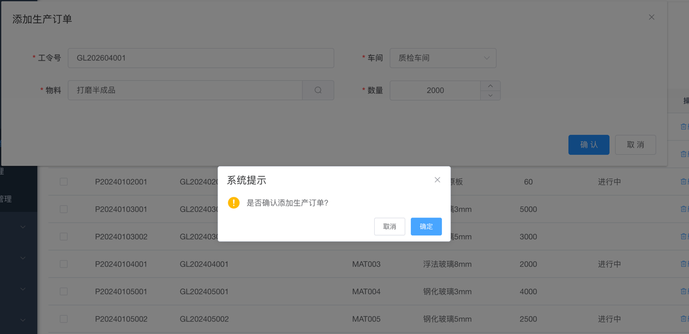
**【图6-16 新增生产领料单】**
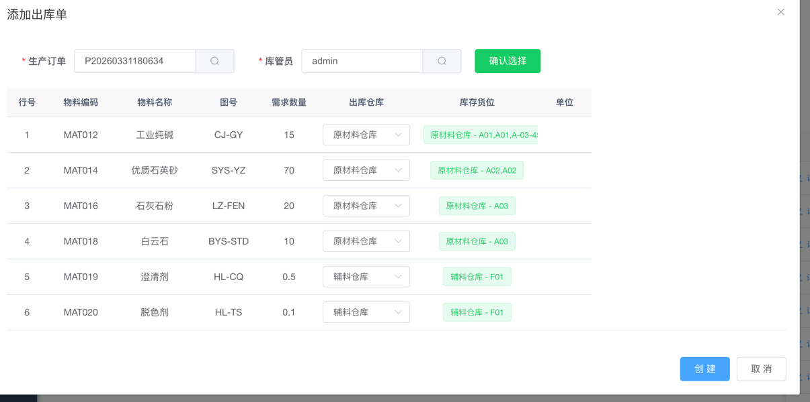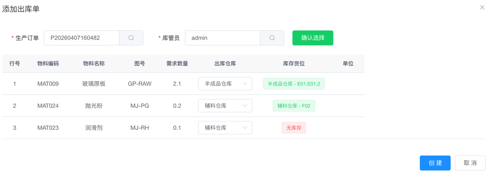
**【图6-17 系统自动计算领料清单】**
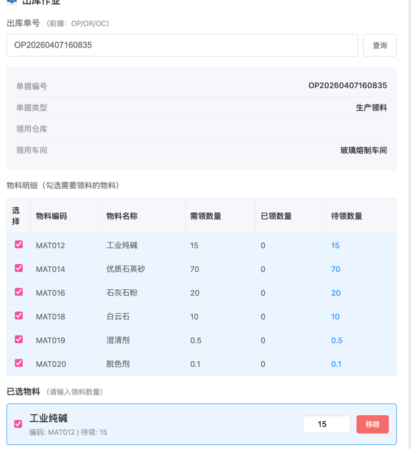
**【图6-18 确认出库成功】**

### 6.3.2 销售出库功能测试

销售管理员根据销售订单创建销售出库单，填写客户信息、出库物料及数量、来源仓库货位等信息。仓库管理员确认出库后，系统扣减库存并更新出库单状态。

| 操作步骤 | 操作描述 | 预期现象 | 测试结果 | 是否通过 |
|---------|---------|---------|---------|---------|
| 1 | 销售管理员点击销售管理-销售出库，新增出库单并填写： 客户名称：北京制造公司 出库物料：MAT20240101 出库数量：20 来源仓库：WH001 来源货位：A01-001 | 系统提示"保存成功"，出库单状态为"待出库" | 与预期一致 | 通过 |
| 2 | 仓库管理员确认销售出库 | 系统提示"出库成功"，出库单状态变更为"已出库"，库存数量扣减20张 | 与预期一致 | 通过 |

**【图6-19 新增销售出库单】**

**【图6-20 确认销售出库成功】**

### 6.3.3 库存不足出库测试

测试当库存数量不足时，系统是否能正确拦截出库操作并给出提示。

| 操作步骤 | 操作描述 | 预期现象 | 测试结果 | 是否通过 |
|---------|---------|---------|---------|---------|
| 1 | 创建出库单，出库数量大于当前库存 | 出库数量：200，当前库存：40 | 与预期一致 | 通过 |
| 2 | 仓库管理员确认出库 | 系统提示"库存不足，当前库存40张，出库数量200张，请调整出库数量或补充库存"，禁止出库操作 | 与预期一致 | 通过 |
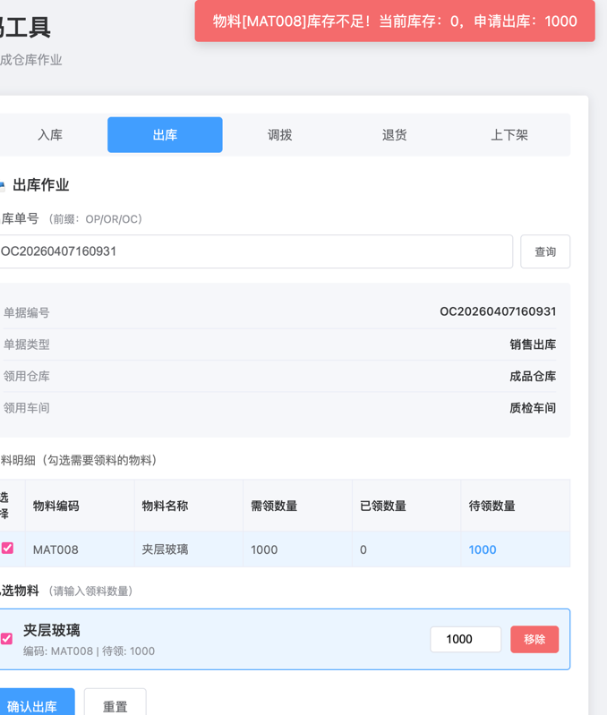
**【图6-21 库存不足提示】**

## 6.4 库存管理与调拨模块测试

库存管理与调拨模块负责库存信息查询、库存流水查询、库存调拨及库存盘点等功能。本节将对库存管理和调拨业务流程进行详细测试。

### 6.4.1 库存信息查询功能测试

仓库管理员可以查询当前库存信息，支持按物料编码、物料名称、仓库、货位等条件进行筛选查询。系统实时显示物料的库存数量、所在仓库货位、最后更新时间等信息。

| 操作步骤 | 操作描述 | 预期现象 | 测试结果 | 是否通过 |
|---------|---------|---------|---------|---------|
| 1 | 仓库管理员点击库存管理-库存信息，输入查询条件：物料编码MAT20240101 | 系统筛选显示该物料的库存记录，包含编码、名称、规格型号、仓库、货位、数量等信息 | 与预期一致 | 通过 |
| 2 | 按仓库筛选：仓库WH001 | 系统显示该仓库下所有物料的库存记录 | 与预期一致 | 通过 |
| 3 | 点击导出按钮 | 系统生成Excel文件并下载 | 与预期一致 | 通过 |
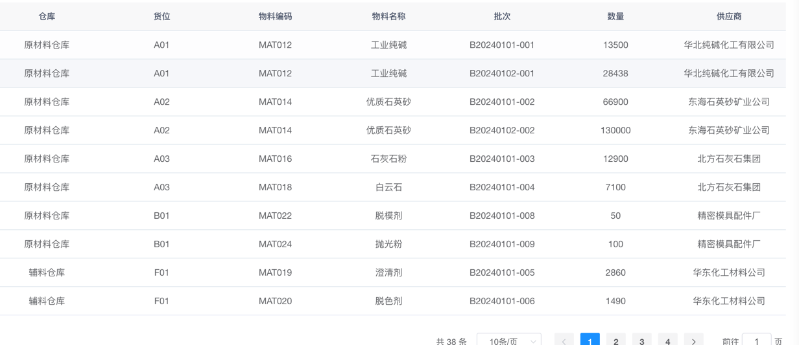
**【图6-22 库存信息查询页面】**
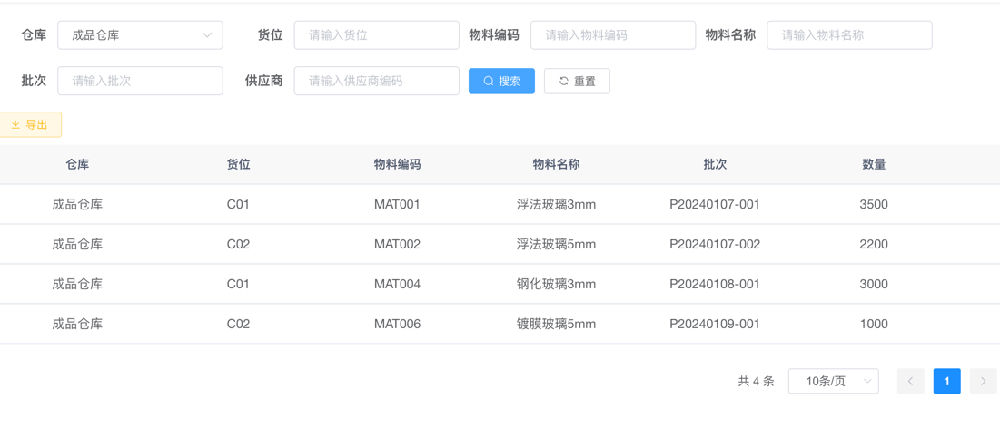
**【图6-23 按仓库筛选库存】**
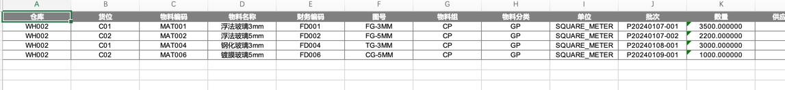
**【图6-24 导出库存数据】**

### 6.4.2 库存流水查询功能测试

仓库管理员可以查询库存流水记录，了解物料的入库、出库、调拨等操作历史。系统记录每次库存变动的时间、类型、数量、操作人等详细信息。

| 操作步骤 | 操作描述 | 预期现象 | 测试结果 | 是否通过 |
|---------|---------|---------|---------|---------|
| 1 | 仓库管理员点击库存管理-库存流水，输入查询条件：物料编码MAT20240101，时间范围2024-03-01至2024-03-31 | 系统显示该物料在指定时间范围内的流水记录，包含流水类型、数量、仓库货位、关联单据号、操作时间、操作人等 | 与预期一致 | 通过 |
| 2 | 按流水类型筛选：入库 | 系统仅显示入库类型的流水记录 | 与预期一致 | 通过 |
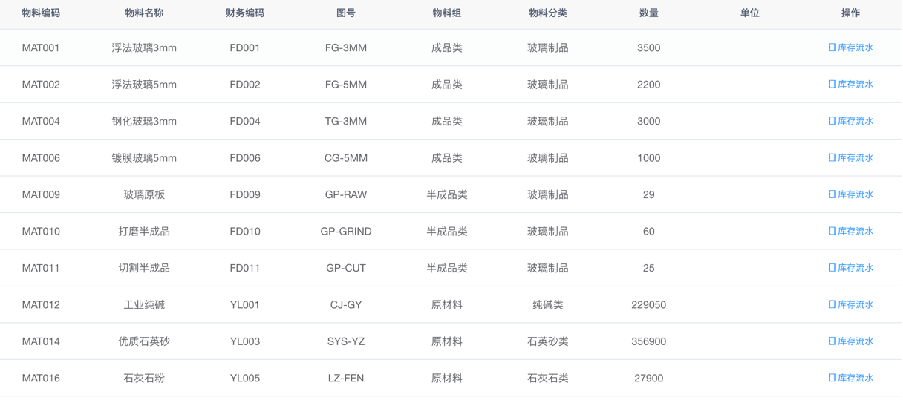
**【图6-25 库存流水查询页面】**
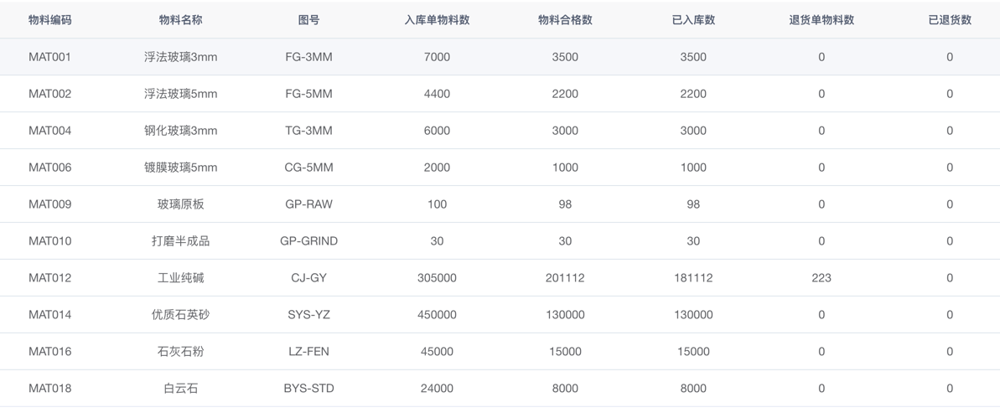
**【图6-26 按流水类型筛选】**

### 6.4.3 库存调拨功能测试

仓库管理员可以创建库存调拨单，将物料从一个仓库货位调拨到另一个仓库货位。填写调拨物料、数量、源仓库货位、目标仓库货位等信息，确认调拨后系统更新库存分布。

| 操作步骤 | 操作描述 | 预期现象 | 测试结果 | 是否通过 |
|---------|---------|---------|---------|---------|
| 1 | 仓库管理员点击调拨管理-库存调拨，新增调拨单并填写： 调拨物料：MAT20240101 调拨数量：30 源仓库：WH001 源货位：A01-001 目标仓库：WH002 目标货位：B01-001 | 系统检查源货位库存充足，提示"保存成功"，调拨单状态为"待调拨" | 与预期一致 | 通过 |
| 2 | 点击确认调拨按钮并确认 | 系统提示"调拨成功"，调拨单状态变更为"已完成" | 与预期一致 | 通过 |
| 3 | 查看库存信息 | 源货位WH001-A01-001库存扣减30张，目标货位WH002-B01-001库存增加30张 | 与预期一致 | 通过 |
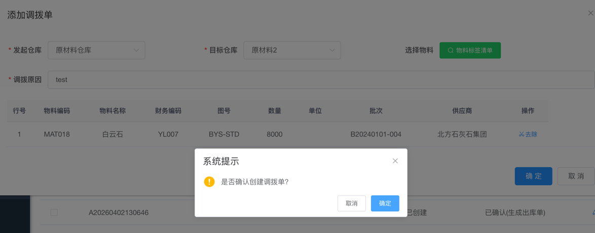
**【图6-27 新增库存调拨单】**
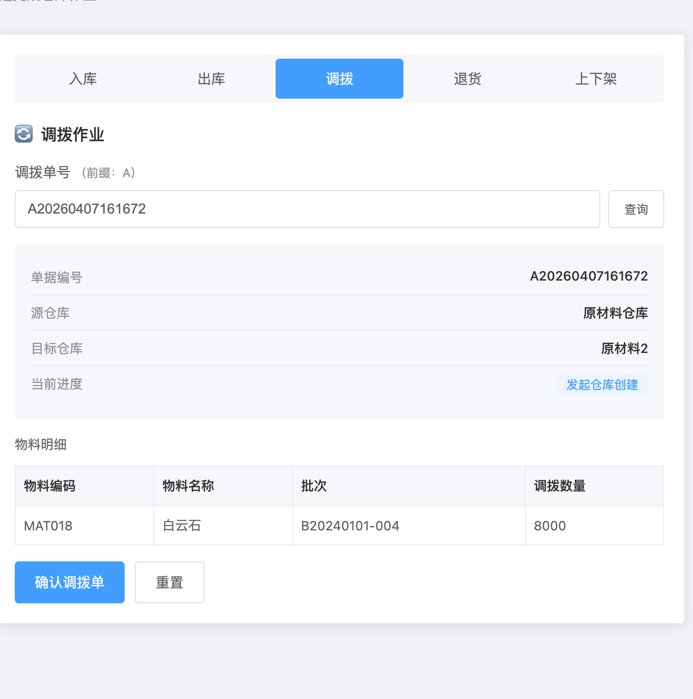
**【图6-28 确认调拨成功】**

**【图6-29 库存信息更新】**

### 6.4.4 库存不足调拨测试

测试当源货位库存数量不足时，系统是否能正确拦截调拨操作并给出提示。

| 操作步骤 | 操作描述 | 预期现象 | 测试结果 | 是否通过 |
|---------|---------|---------|---------|---------|
| 1 | 创建调拨单，调拨数量大于源货位库存 | 调拨数量：50，源货位库存：10 | 与预期一致 | 通过 |
| 2 | 点击确认调拨 | 系统提示"源货位库存不足，当前库存10张，调拨数量50张，请调整调拨数量"，禁止调拨操作 | 与预期一致 | 通过 |
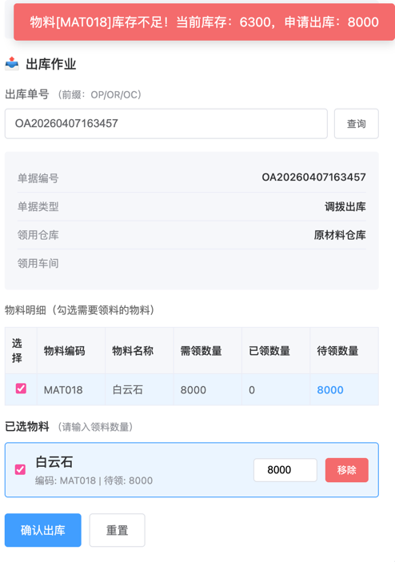
**【图6-30 库存不足调拨提示】**

## 6.5 测试总结

本章对仓库管理系统的四个核心功能模块进行了全面的功能测试，包括基础数据管理、入库管理、出库管理及库存管理与调拨模块。测试过程严格遵循实际业务流程，通过设计详细的测试用例，模拟真实用户操作场景，对系统的各项功能进行了逐一验证。

测试结果表明，系统各功能模块均能正常运行，符合预期设计要求。具体测试情况如下：

1. **基础数据管理模块**：物料信息管理、物料BOM管理、仓库货位管理等功能运行正常。物料信息的新增操作能够正确执行，BOM数据支持通过Excel导入和导出，仓库和货位的新增管理功能完善，货位标签打印功能能够正常生成包含二维码的PDF文件。

2. **入库管理模块**：采购入库和入库质检确认业务流程完整。入库单创建、确认入库、物料标签生成与打印等功能运行正常，质检员能够正确执行质检操作并更新质检状态，库存数据在入库确认后能够准确更新。

3. **出库管理模块**：生产领料出库和销售出库业务流程完整。生产领料出库支持根据生产订单自动展开BOM计算所需物料及数量，销售出库单创建和确认功能正常，库存扣减操作准确。库存不足时系统能够正确拦截出库操作并给出明确提示，有效防止超量出库。

4. **库存管理与调拨模块**：库存信息查询支持按物料编码、仓库等多条件筛选，并支持数据导出。库存流水查询能够按时间范围和流水类型进行筛选，完整记录库存变动历史。库存调拨功能能够准确更新源货位和目标货位的库存分布，库存不足时能够正确拦截调拨操作并给出提示。

测试过程中发现的所有功能均按预期正常工作，未发现重大缺陷。系统界面友好，操作流程清晰，用户体验良好。系统的数据一致性和完整性得到有效保障，业务逻辑处理正确，异常情况处理合理。测试结果证明，该仓库管理系统已具备上线运行的条件，能够满足企业仓库管理的实际业务需求。

