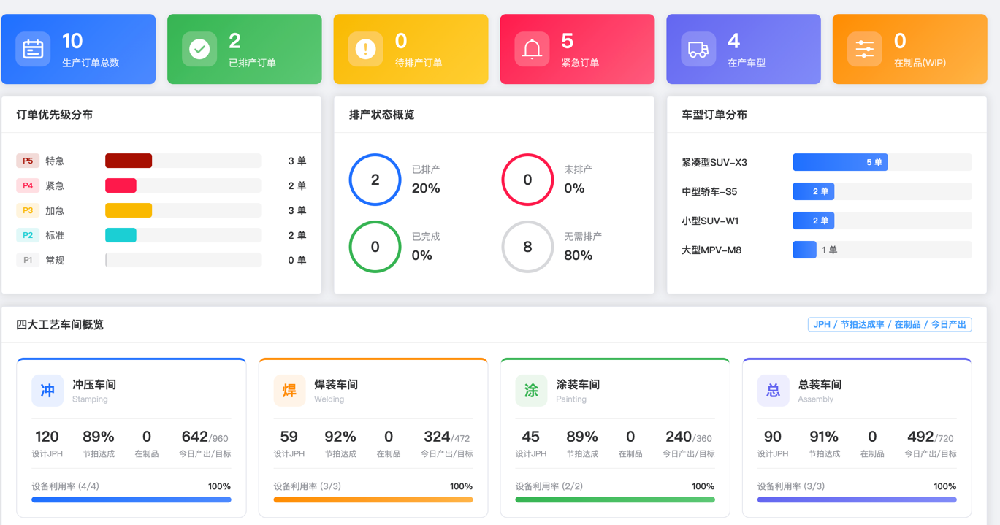

# 第2章 系统需求分析

## 2.1 系统功能需求分析

随着汽车制造行业竞争日益激烈，企业对生产管理的精细化水平提出了更高要求。智能排产系统作为连接企业计划层与执行层的核心工具，需要为汽车制造企业提供完善的生产计划管理解决方案。通过深入调研汽车制造企业的生产管理业务流程，分析现有排产系统的优缺点，本智能排产系统需要实现的功能主要涵盖基础数据管理、工艺与计划管理、智能排产、结果展示以及追溯管理等方面，详细的功能需求如表2-1所示。

**表2-1 系统功能需求表**

| 功能类别 | 功能名称 | 功能描述 |
|---------|---------|---------|
| 基础数据管理 | 物料管理 | 维护物料基本信息，包括物料编码、名称、规格、类型、单位等，支持按制造类型筛选物料 |
| | 生产资源管理 | 维护设备、工位、人员等生产资源信息，支持资源分组管理 |
| | 制造BOM管理 | 管理产品的物料清单与层级结构，支持BOM树形可视化展示 |
| | 车型管理 | 管理产品车型信息，支持关联默认BOM、工艺路线与排产策略 |
| | 来料订单管理 | 维护原材料来料计划，跟踪物料到货批次与数量 |
| 工艺与计划管理 | 工序管理 | 维护工序模板信息，定义工序类型、标准工时、可用资源等参数 |
| | 工艺路线管理 | 管理产品的加工工艺路线，编排工序顺序与关联关系，支持路线的启用与禁用 |
| | 工作模式管理 | 定义班次、工时与休息规则等工作模式模板 |
| | 工作日历管理 | 基于工作模式配置各资源的可用时间与休息日，管理资源与日历的关联关系 |
| | 生产订单管理 | 创建与编辑生产订单，支持整车订单自动展开BOM生成子订单、分配VIN码、启用或禁用排产状态 |
| 智能排产 | 排产策略配置 | 设置排产优化目标与约束条件，配置排产规则，支持策略的启用与禁用 |
| | 智能调度 | 基于排产策略与待排产订单自动生成排产计划，支持排产进度查询、计划预览确认与放弃 |
| | 任务调整 | 对排产任务进行拆分（按数量、按任务数、按完成量）、合并、移动、锁定与解锁等人工调整操作 |
| | 报工管理 | 录入与更新任务执行进度，支持单条及批量报工，支持报工数据导入 |
| | 任务派工导出 | 将排产结果导出为Excel文件，下发至具体生产单元 |
| 结果展示 | 资源甘特图 | 以资源维度展示排产任务的时间分配与负荷情况，支持任务详情查看 |
| | 订单甘特图 | 以订单维度展示各生产订单的排产进度与时间安排 |
| | 物料甘特图 | 以物料维度展示物料需求与供应的时间匹配情况 |
| | 报表字段配置 | 自定义各类排产报表的展示字段与排列顺序 |
| | Dashboard仪表盘 | 以数据看板形式展示生产订单总量、优先级分布等关键运营指标 |
| 追溯管理 | VIN追溯 | 根据VIN码查询整车生产履历，展示生产任务时间线与关键节点记录 |

## 2.2 用例分析

本系统各用例之间的联系，主要由真实业务流程的先后顺序与数据引用关系所决定，整体以"基础数据打底、订单提出需求、排产生成计划、任务承接执行、结果统一呈现、追溯闭环校验"为主线展开。基于系统的模块划分，将用例图按主数据管理模块、工艺与计划管理模块、智能排产模块三个维度分别展示，如图2-1、图2-2、图2-3所示。

图2-1为主数据管理模块用例图。该模块包含物料管理、车型管理、制造BOM管理和生产资源管理四个用例，为整个系统提供基础数据支撑。其中，制造BOM的建立离不开物料主数据支撑，BOM的每一项组成都必须从物料库中选择才能形成可用的产品结构，因此制造BOM管理以include关系包含物料管理；车型管理则更具弹性，车型可以选择配置默认BOM以便后续调用，但不配置也不影响车型信息维护，因此车型管理以extend关系扩展制造BOM管理；生产资源管理作为独立用例，负责维护设备、工位、人员等生产资源信息，为后续排产提供资源能力数据。

**图2-1 主数据管理模块用例图**

图2-2为工艺与计划管理模块用例图。该模块包含工艺管理、工艺路线管理、工作日历管理、生产订单管理和VIN追溯五个用例，承担着工艺信息维护与生产计划输入的职责。工艺路线的配置依赖工序信息，路线中的每个节点都需要关联具体工序，因此工艺路线管理以include关系包含工艺管理；工作日历管理负责设置工作时间、休息日与节假日等排产基础配置，为后续排产引擎提供时间约束依据。生产订单管理是排产的需求入口，订单在创建时必须明确生产对象，因此以include关系包含主数据管理模块中的物料管理，而订单是否展开BOM取决于业务类型与配置情况，因此以extend关系扩展制造BOM管理（图中灰色用例表示来自主数据管理模块的外部引用）。VIN追溯以生产订单为主线串联产品生产履历与关键记录，因此以include关系包含生产订单管理，实现质量追溯闭环。

**图2-2 工艺与计划管理模块用例图**

图2-3为智能排产模块用例图。该模块包含排产策略配置、智能调度、任务分派、任务调整、排产结果查看和Dashboard仪表盘六个用例，是系统的核心功能模块。智能调度运行前需要先确定排产策略与优化目标，因此以include关系包含排产策略配置；同时，生产订单作为排产输入为系统提供数量、交期等关键约束，因此智能调度以include关系包含工艺与计划管理模块中的生产订单管理（图中灰色用例表示外部引用）。排产结果产出后，排产结果查看以甘特图、报表等方式将计划直观呈现，因此以include关系包含智能调度。任务分派承接排产方案将计划下达到具体产线与资源单元，以include关系包含智能调度；任务调整属于可选步骤，当现场出现插单、资源变更等情况时可进行人工优化，因此以extend关系扩展任务分派。Dashboard仪表盘作为综合看板，从多类业务数据中汇总关键指标，支持排产分析与日常运营监控。

**图2-3 智能排产模块用例图**

## 2.3 数据流图分析

为进一步分析系统各模块的数据流转关系，本节从数据流图的角度对三个核心模块进行建模，展示外部实体、加工处理节点与数据存储之间的数据流动路径。

### 2.3.1 主数据管理模块数据流图

图2-4展示了主数据管理模块的数据流动与加工关系。图中包含两个外部实体（操作人员和前端页面）、三个加工处理节点（P1.1校验与持久化、P1.2查询处理、P1.3关联检查与删除）和两个数据存储（D1主数据表、D2关联业务表）。新增/修改请求经P1.1校验后写入D1；查询请求经P1.2从D1获取数据；删除请求经P1.3先向D2查询关联引用，无关联则对D1执行逻辑删除。各加工节点将响应返回前端页面，前端将结果呈现给操作人员。

**图2-4 主数据管理模块数据流图**

### 2.3.2 工艺与计划管理模块数据流图

图2-5展示了工艺与计划管理模块的数据流动与加工关系。图中包含两个外部实体（操作人员和前端页面）、四个加工处理节点（P2.1编码校验、P2.2数据持久化、P2.3 BOM展开、P2.4关联检查与删除）和两个数据存储（D1工艺数据表、D2订单数据表）。新增/修改请求经P2.1编码校验通过后流向P2.2，根据数据类型分别写入D1或D2；若为整车订单，P2.2将数据传递至P2.3进行BOM展开并写入D2。删除请求由P2.4查询D1中的关联引用后执行逻辑删除。各加工节点将响应返回前端页面，前端将结果呈现给操作人员。

**图2-5 工艺与计划管理模块数据流图**

### 2.3.3 智能排产模块数据流图

图2-6展示了智能排产模块的数据流动与加工关系。图中包含两个外部实体（操作人员和前端页面）、四个加工处理节点（P3.1配置排产策略、P3.2创建排产任务、P3.3引擎求解与生成计划、P3.4查看与下发）和三个数据存储（D1排产策略表、D2排产任务表、D3计划任务表）。前端将策略配置数据发送至P3.1写入D1；任务创建数据发送至P3.2，P3.2写入D2后触发P3.3求解，P3.3将计划任务写入D3并将计划数据传递至P3.4；P3.4负责更新D3中的任务状态并将下发结果返回前端。各加工节点的响应经前端页面呈现给操作人员。

**图2-6 智能排产模块数据流图**

## 2.4 系统原型

原型界面如图所示，整体采用“左侧导航 + 顶部功能入口 + 中央看板”的布局形式。
用户可通过左侧菜单快速切换物料、工艺、资源、排产、追溯等核心模块，便于在不同业务环节间顺畅跳转。
首页以数据看板为主，采用卡片与图表组合展示生产订单总量等关键指标，并辅以订单优先级分布等视图，实现对排产态势与生产运行状态的直观掌握，方便用户进行整体监控与快速决策

## 2.5 本章小结

本章围绕汽车制造APS智能排产系统的功能需求进行了系统分析，对核心业务功能与模块划分做了梳理与说明。主要包括基础数据管理、生产订单管理、排产策略配置与智能调度、任务分派与进度跟踪、排产结果展示以及VIN追溯等功能模块。其次，结合系统业务流程给出了主数据管理模块、工艺与计划管理模块、智能排产模块三个维度的用例分析。随后，通过数据流图对三个核心模块的数据流转关系进行了建模，展示了外部实体、加工处理节点与数据存储之间的数据流动路径。最后，给出了关键界面的原型设计，为后续系统详细设计与实现提供了依据。