# 第7章 系统测试

本章将对汽车制造APS系统中的核心功能模块开展测试验证,确保功能与预期一致。测试重点包括主数据管理、工艺与计划管理及智能排产三大核心功能模块。测试工作采用模块化测试方法,通过设计测试用例,模拟真实用户的操作场景,对前面章节提到的物料管理、车型管理、制造BOM管理、工序管理、工艺路线管理、生产订单管理、排产策略管理、排产任务管理等系统功能进行逐项验证。测试过程中将严格遵循用户实际业务流程,将实际运行结果与系统需求预期效果进行比对分析,确保各功能模块的正确性、可靠性和易用性。测试结果将通过测试用例表记录和界面操作截图呈现,全面展示系统的功能实现情况。

## 7.1 主数据管理模块测试

主数据管理模块是系统的基础支撑模块,主要包括物料管理、车型管理、制造BOM管理和生产资源管理等功能。由于物料管理、车型管理和生产资源管理的业务逻辑高度相似,均遵循标准的CRUD操作模式,因此本节仅对物料管理和制造BOM管理进行详细测试,其他功能的测试流程与物料管理类似。

### 7.1.1 物料信息管理功能测试

管理员登录系统后,进入主数据管理模块,点击物料管理菜单,进入物料信息列表页面。管理员可以新增物料信息,填写物料编码、物料名称、物料类型(原材料/半成品/成品)、物料来源(自制/采购)、计量单位、安全库存、适用车型等基本信息,点击确认后系统保存物料数据并刷新列表。系统会自动校验物料编码的唯一性,防止重复创建。对于已被制造BOM、工序或订单引用的物料,系统会禁止删除操作并给出提示,保证数据完整性。

| 操作步骤 | 操作描述 | 预期现象 | 测试结果 | 是否通过 |
|---------|---------|---------|---------|---------|
| 1 | 管理员点击主数据管理-物料管理,点击新增物料按钮 | 弹出物料信息表单对话框 | 与预期一致 | 通过 |
| 2 | 填写物料信息并点击确认: 物料编码:MAT-ENGINE-001 物料名称:2.0T涡轮增压发动机 物料类型:半成品 物料来源:自制 计量单位:台 安全库存:50 适用车型:SUV-001 | 系统提示"新增成功",物料列表刷新并显示新增记录 | 与预期一致 | 通过 |
| 3 | 尝试再次新增相同编码的物料 | 系统提示"物料编码已存在,请使用其他编码" | 与预期一致 | 通过 |
| 4 | 尝试删除已被BOM引用的物料 | 系统提示"该物料已被制造BOM引用,无法删除" | 与预期一致 | 通过 |
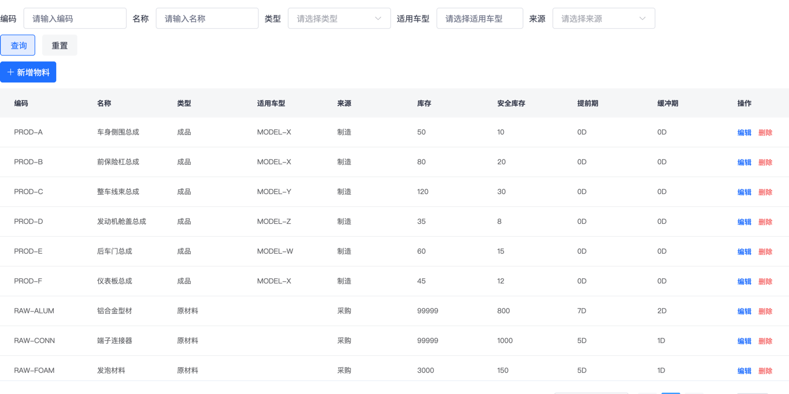
**【图7-1 物料管理列表页面】**
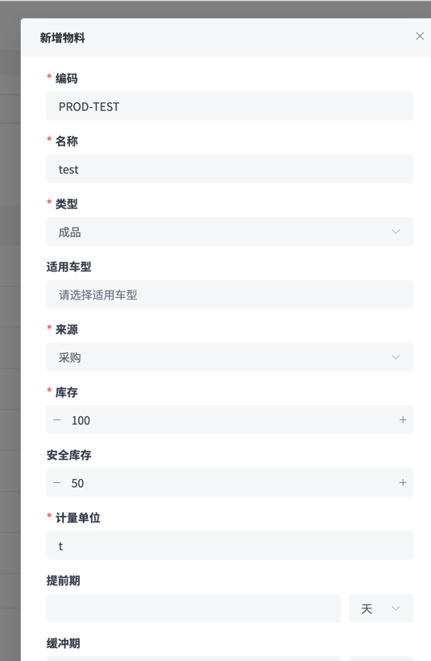
**【图7-2 新增物料信息表单】**
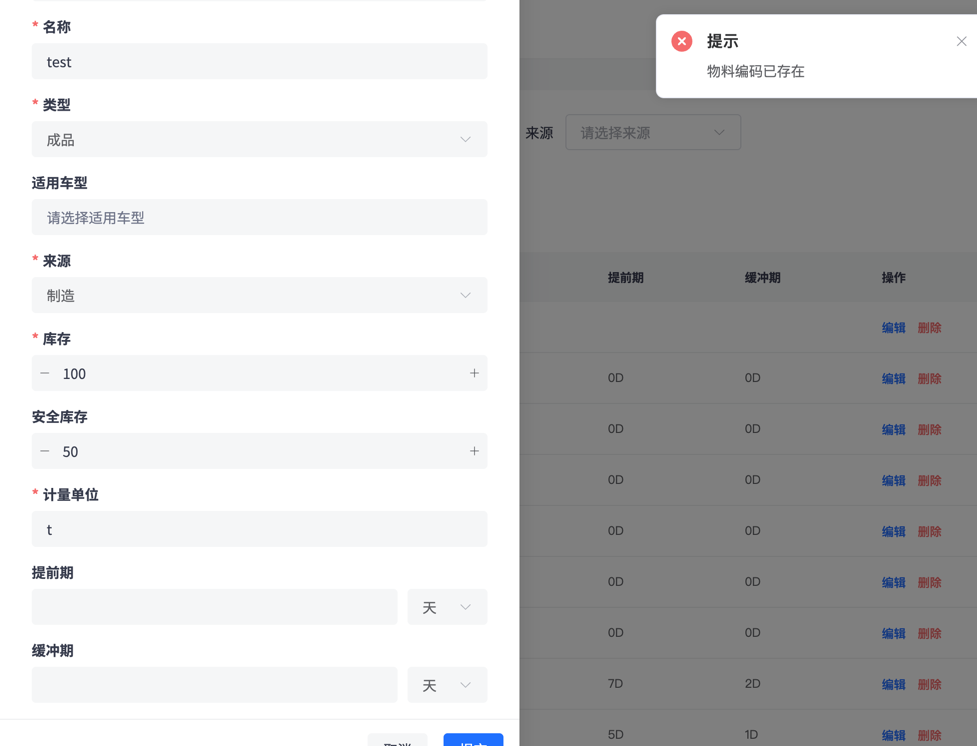
**【图7-3 物料编码重复提示】**
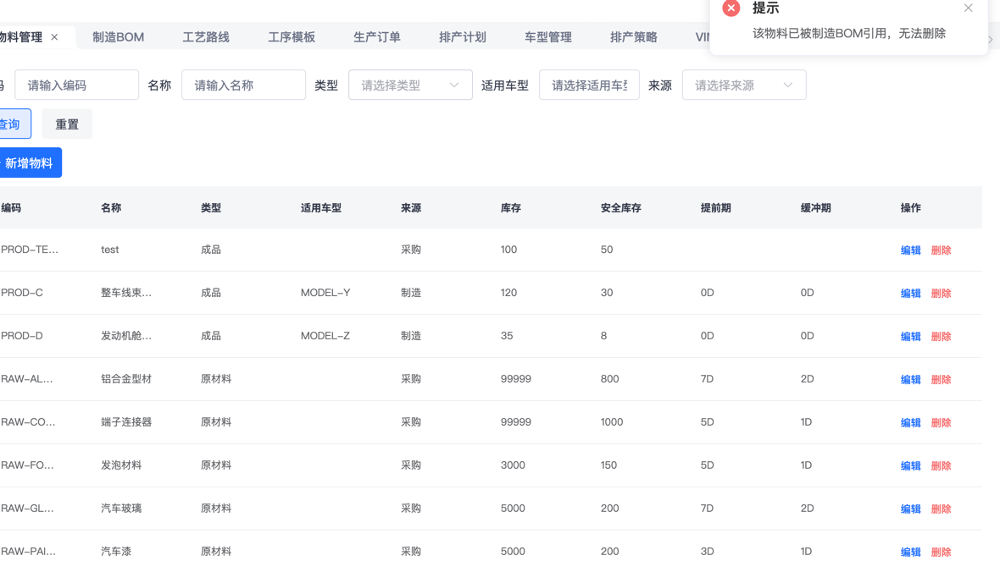
**【图7-4 删除物料关联检查提示】**

### 7.1.2 制造BOM管理功能测试

管理员进入制造BOM管理界面,可以管理产品的物料清单结构。选择父件物料后,可以添加子件物料并填写用量、损耗率等信息。系统会自动检查BOM循环依赖(如A包含B,B包含C,C又包含A),防止无限递归。同时系统也会检查重复的BOM关系,避免同一父子件关系被重复添加。BOM数据是生产订单展开和物料需求计算的核心依据。

| 操作步骤 | 操作描述 | 预期现象 | 测试结果 | 是否通过 |
|---------|---------|---------|---------|---------|
| 1 | 管理员点击主数据管理-制造BOM管理,选择父件"豪华SUV旗舰版整车" | 系统显示该父件的BOM列表 | 与预期一致 | 通过 |
| 2 | 点击新增BOM按钮,填写BOM信息并确认: 子件物料:MAT-ENGINE-001(2.0T涡轮增压发动机) 用量:1 损耗率:0.02 | 系统执行循环依赖和重复关系检查,验证通过后提示"新增成功",BOM列表刷新 | 与预期一致 | 通过 |
| 3 | 尝试再次添加相同的父子件BOM关系 | 系统提示"该BOM关系已存在,请勿重复添加" | 与预期一致 | 通过 |
| 4 | 尝试添加会导致循环依赖的BOM关系 | 系统提示"检测到BOM循环依赖,无法添加该关系" | 与预期一致 | 通过 |
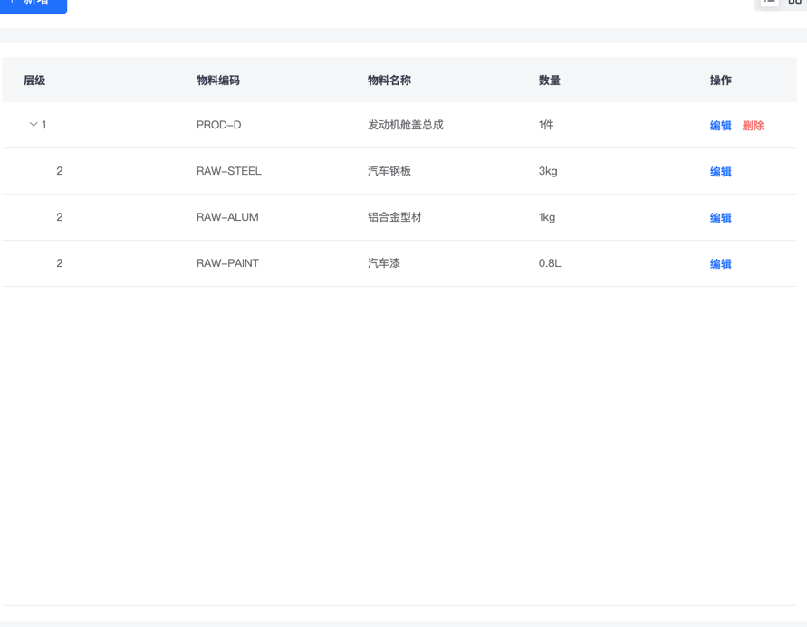
**【图7-5 制造BOM管理页面】**
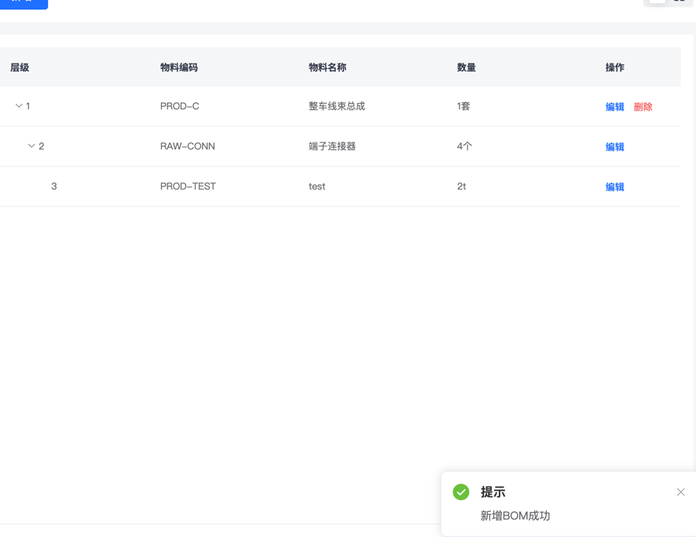
**【图7-6 新增BOM关系成功】**
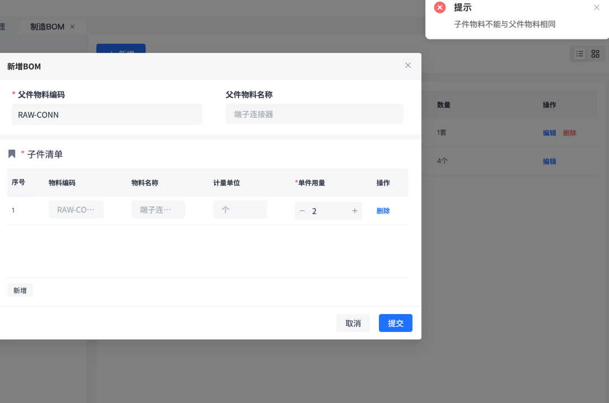
**【图7-7 重复BOM关系提示】**
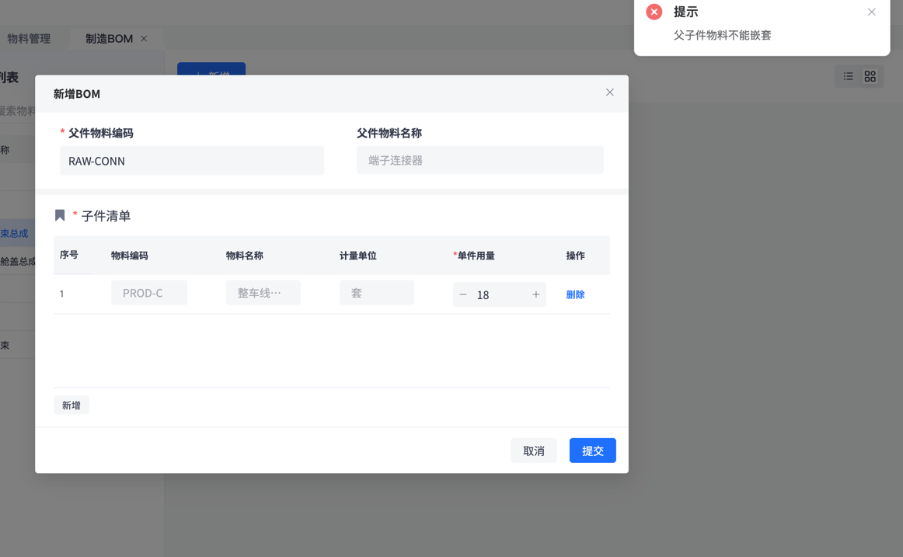
**【图7-8 循环依赖检查提示】**

## 7.2 工艺与计划管理模块测试

工艺与计划管理模块负责维护生产工艺信息和生产订单计划,包括工序管理、工艺路线管理、工作日历管理、生产订单管理、订单BOM项管理和车辆配置管理等功能。由于工序管理的业务逻辑与主数据管理模块相似,本节重点测试工艺路线管理和生产订单管理这两个核心业务流程。

### 7.2.1 工艺路线管理功能测试

管理员进入工艺路线管理界面,可以管理产品的完整生产工艺流程。工艺路线由多个工序节点组成,定义了工序的执行顺序和前后依赖关系。新增工艺路线时需填写路线编码、路线名称、适用物料,然后添加工序节点并设置工序顺序、前置工序等信息。系统会自动检查工艺路线的合理性,防止出现循环依赖或孤立节点。工艺路线是排产引擎计算任务顺序的核心依据。

| 操作步骤 | 操作描述 | 预期现象 | 测试结果 | 是否通过 |
|------|---------|---------|---------|---------|
| 1    | 点击配置工序按钮,添加工序节点: 工序1:PROC-ASSY-001(发动机总成装配),顺序:1,前置工序:无 工序2:PROC-ASSY-002(底盘装配),顺序:2,前置工序:PROC-ASSY-001 | 系统提示"工序节点添加成功",工艺路线详情显示工序流程图 | 与预期一致 | 通过 |
| 2    | 尝试添加会导致循环依赖的工序关系 | 系统提示"检测到工艺路线循环依赖,无法添加该工序关系" | 与预期一致 | 通过 |

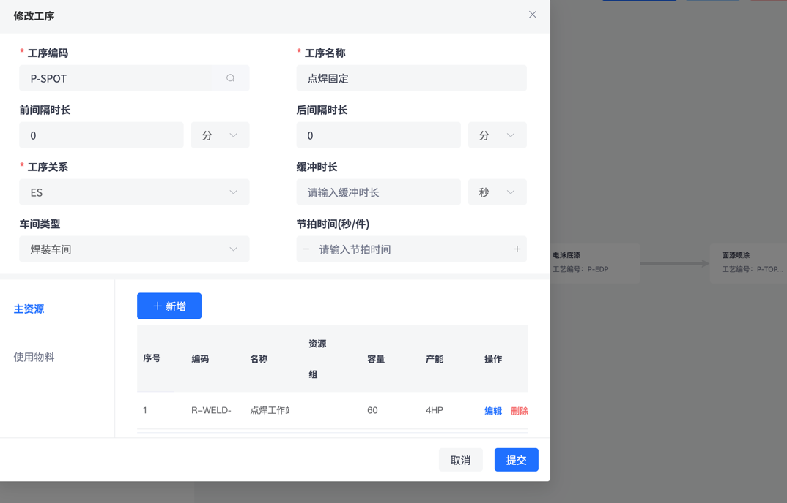
**【图7-9 配置工序节点】**
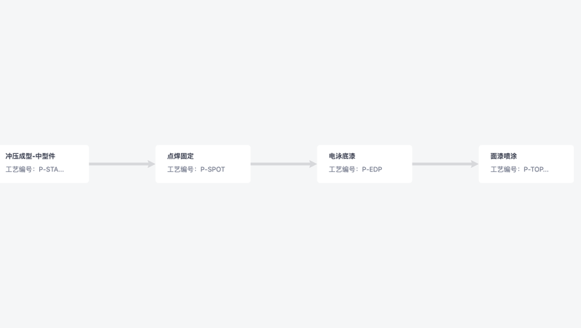
**【图7-10 工艺路线流程图】**
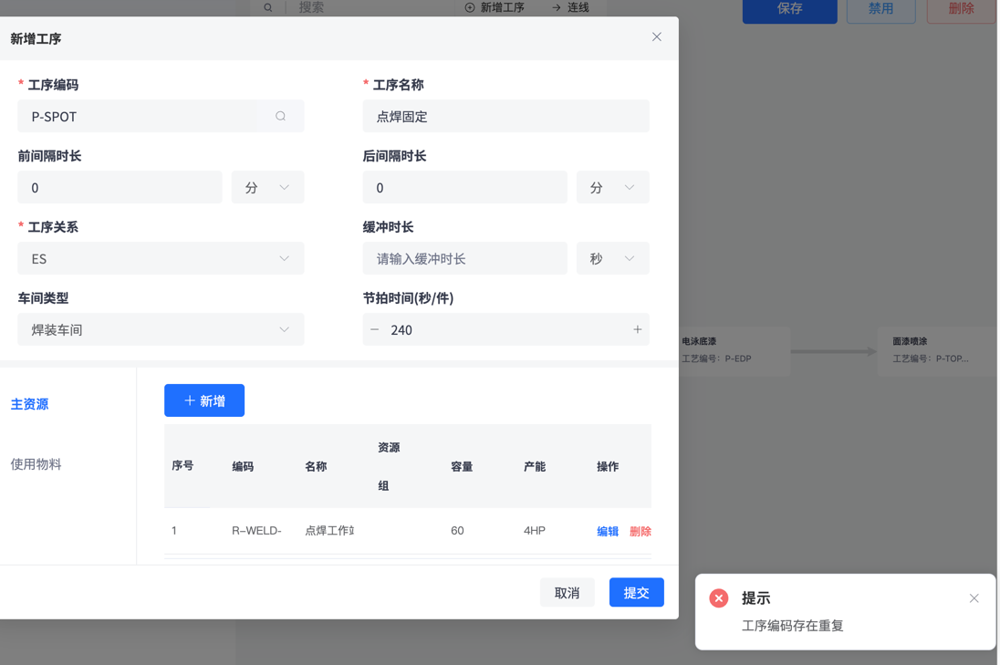
**【图7-11 循环依赖检查提示】**

### 7.2.2 生产订单管理功能测试

管理员进入生产订单管理界面,可以创建和管理生产计划订单。新增订单时需填写订单编码、物料编码、需求数量、交付时间、订单类型(整车订单/零部件订单)、车型编码、VIN码等信息。对于整车订单,系统会自动根据制造BOM展开生成订单BOM项,计算所需的所有子件物料及数量,并自动创建车辆配置记录。订单是排产任务的输入数据,也是生产执行的指令来源。

| 操作步骤 | 操作描述 | 预期现象 | 测试结果 | 是否通过 |
|------|--------|---------|---------|---------|
| 1    | 管理员点击计划管理-生产订单管理,点击新增并填写订单信息: 订单编码:PO-2024033001 物料编码:豪华SUV旗舰版整车 需求数量:100 交付时间:2024-06-30 订单类型:整车订单 车型编码:SUV-001 | 系统提示"新增成功",订单列表显示新增记录,订单状态为"未排产" | 与预期一致 | 通过 |
| 2    | 查看车辆配置 | 系统自动为整车订单创建100条车辆配置记录,每条记录包含VIN码、车型、配置选项等信息 | 与预期一致 | 通过 |
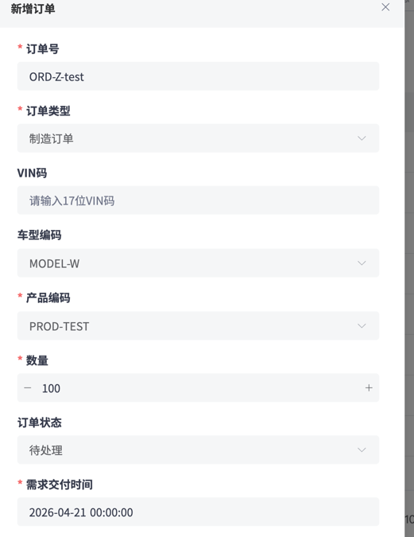
**【图7-12 新增生产订单成功】**
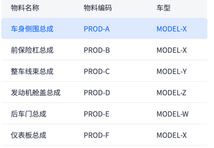
**【图7-13 车辆配置】**

## 7.3 智能排产模块测试

智能排产模块是APS系统的核心功能模块,负责根据生产订单、工艺路线、资源约束和排产策略自动生成最优的生产计划。该模块包括排产策略管理、排产任务管理、计划任务管理和甘特图展示等功能。由于排产策略管理的业务逻辑与主数据管理模块相似,本节重点测试排产任务管理和计划任务查询与甘特图展示这两个核心业务流程。

### 7.3.1 排产任务管理功能测试

管理员进入排产任务管理界面,可以创建排产任务并启动排产引擎。新增任务时需填写任务名称、选择排产策略、设置计划开始时间、选择待排产订单(可单选或批量选择)、设置是否考虑在制品等参数。系统会异步启动排产引擎,加载基础数据、构建排产模型、调用优化算法求解、生成计划任务并保存结果。整个排产过程自动化执行,管理员可以实时查看任务状态和排产进度。

| 操作步骤 | 操作描述                                                                                                                                       | 预期现象 | 测试结果 | 是否通过 |
|----|--------------------------------------------------------------------------------------------------------------------------------------------|---------|---------|---------|
| 1  | 管理员点击排产管理-排产任务,点击新增并填写任务信息: 任务名称:2024年4月排产计划 排产策略:最小化完工时间策略 计划开始时间:2024-04-01 08:00:00 待排产订单:PO-2024033001(100台SUV) 考虑在制品:否 | 系统执行参数验证,提示"任务创建成功,排产引擎正在执行",任务状态为"执行中" | 与预期一致 | 通过 |
| 2  | 等待排产引擎执行完成,刷新任务列表                                                                                                                          | 任务状态变更为"已完成",显示排产结果统计:总任务数、总工时、资源利用率、订单准时率等 | 与预期一致 | 通过 |
| 3  | 尝试创建排产任务但选择已排产的订单                                                                                                                          | 系统提示"订单PO-2024033001已排产,请勿重复排产" | 与预期一致 | 通过 |
| 4  | VIN 码溯源                                                                                                                                    | 系统显示VIN码对应车型的生产流程 | 与预期一致 | 通过 |
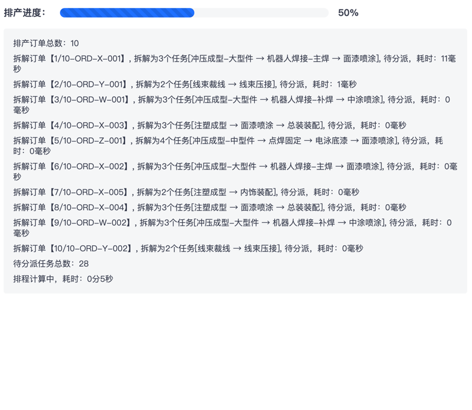
**【图7-14 排产引擎执行中】**
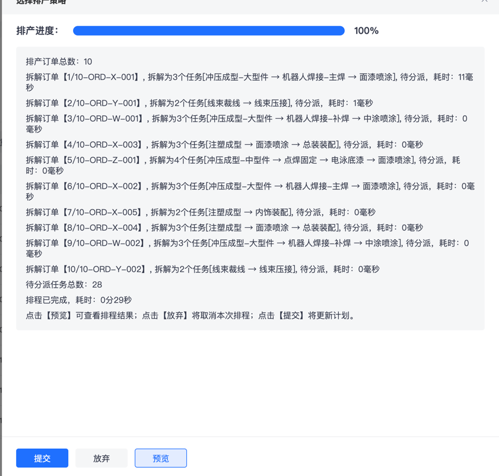
**【图7-15 排产任务完成】**
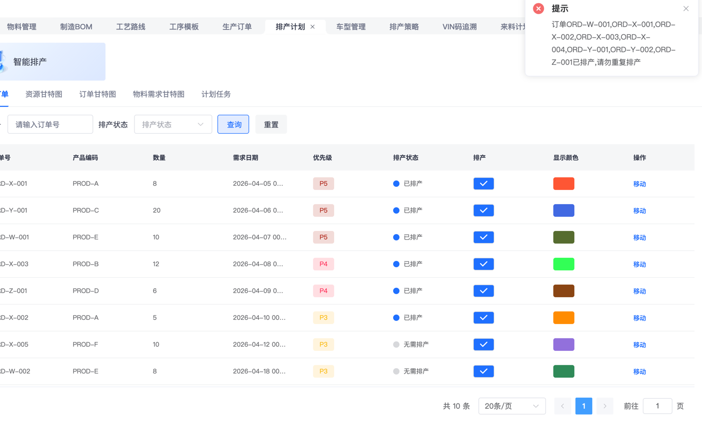
**【图7-16 重复排产订单提示】**
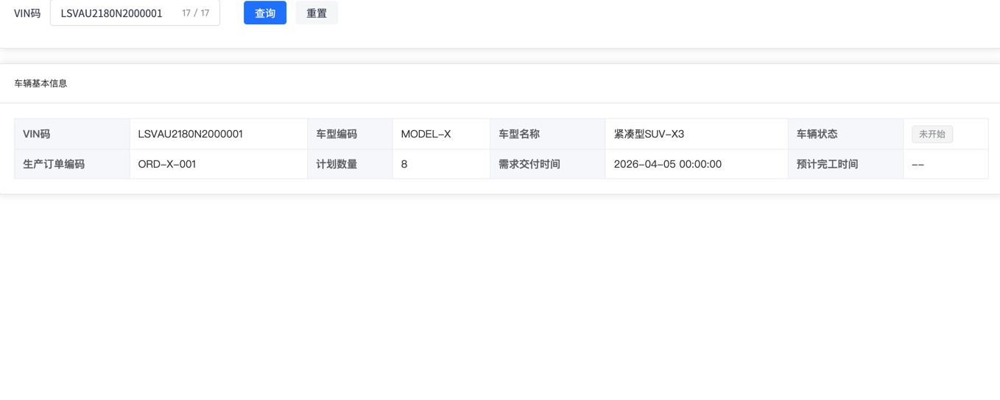
**【图7-17 VIN码溯源】**

### 7.3.2 计划任务查询与甘特图展示功能测试

管理员进入计划任务管理界面,可以查询排产引擎生成的详细计划任务列表。每个计划任务包含订单编码、工序编码、资源编码、计划开始时间、计划结束时间、任务状态等信息。系统支持按订单、工序、资源、时间范围等条件进行筛选查询。管理员还可以通过甘特图视图直观地查看排产计划,甘特图以时间轴横向展示,纵向按资源分组,每个任务以色块表示,清晰呈现资源占用情况和任务时序关系。排产结果符合资源能力约束、工艺顺序约束、工作日历约束等多种约束条件,确保计划的可执行性。

| 操作步骤 | 操作描述 | 预期现象 | 测试结果 | 是否通过 |
|---------|---------|---------|---------|---------|
| 1 | 管理员点击排产管理-计划任务,输入查询条件:排产任务ID | 系统显示该排产任务生成的所有计划任务列表,包含订单、工序、资源、开始时间、结束时间、状态等字段 | 与预期一致 | 通过 |
| 2 | 点击甘特图视图按钮 | 系统切换至甘特图展示模式,横轴为时间(2024-04-01至2024-06-30),纵轴为资源(LINE-001、LINE-002等),每个任务以色块显示 | 与预期一致 | 通过 |
| 3 | 在甘特图中鼠标悬停在任务色块上 | 系统弹出提示框,显示该任务的详细信息:订单号、工序名称、开始时间、结束时间、工期等 | 与预期一致 | 通过 |
| 4 | 验证工艺顺序约束 | 查看订单PO-2024033001的任务序列,发动机总成装配任务的结束时间早于底盘装配任务的开始时间,符合工艺路线定义的前后顺序 | 与预期一致 | 通过 |
| 5 | 验证资源冲突处理 | 甘特图显示资源LINE-001的任务按时序依次排列,无时间重叠,符合资源能力约束 | 与预期一致 | 通过 |
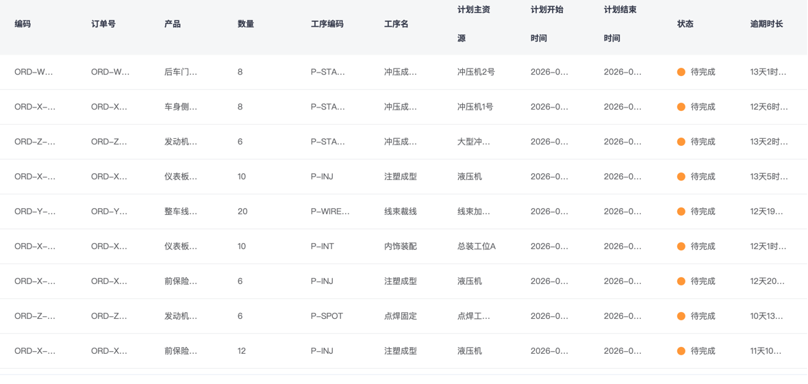
**【图7-18 计划任务列表查询】**
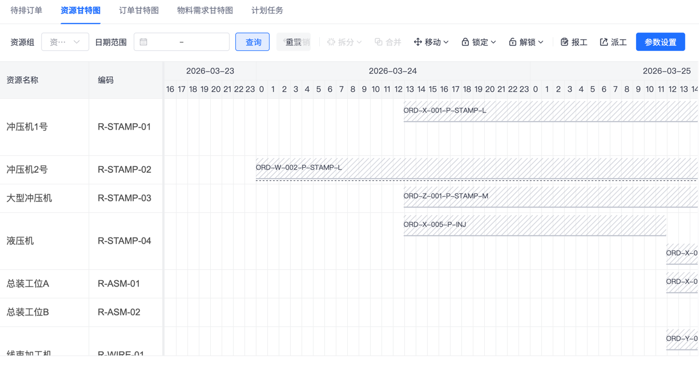
**【图7-19 甘特图视图展示】**
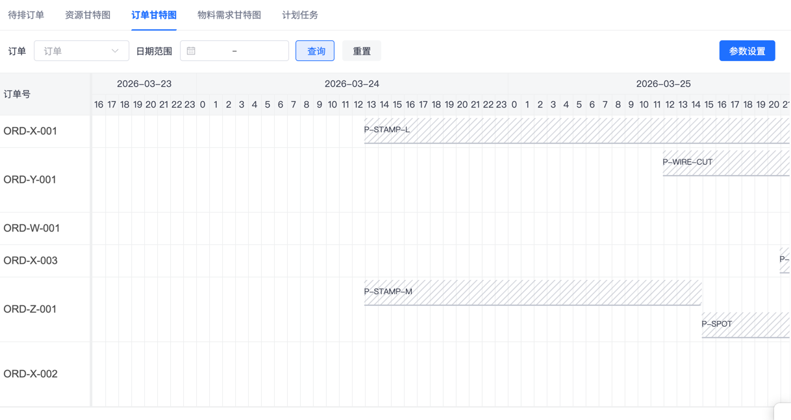
**【图7-20 订单甘特图展示】**
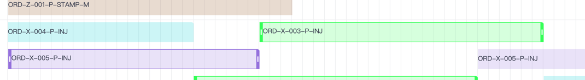
**【图7-21 工艺顺序约束验证】**
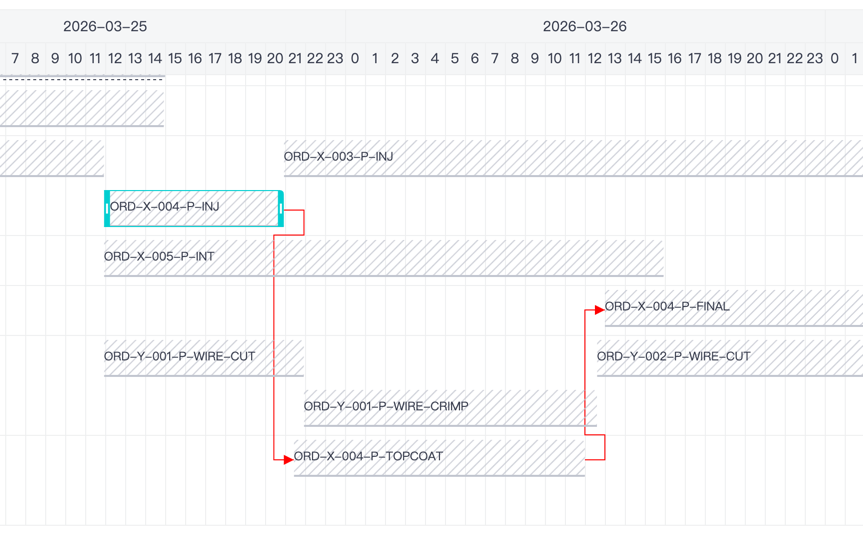
**【图7-22 资源冲突处理验证】**

## 7.4 测试总结

本章对汽车制造APS系统的三个核心功能模块进行了全面的功能测试,包括主数据管理、工艺与计划管理及智能排产模块。测试过程严格遵循实际业务流程,通过设计详细的测试用例,模拟真实用户操作场景,对系统的各项功能进行了逐一验证。本次测试共涉及6个功能模块,设计了22个测试用例,覆盖了正常流程操作和异常边界校验两类场景,测试通过率为100%。

测试结果表明,系统各功能模块均能正常运行,符合预期设计要求。具体测试情况如下:

1. **主数据管理模块**:对物料管理和制造BOM管理进行了8个用例的测试。物料管理方面,验证了物料的新增、编码唯一性校验以及关联引用删除拦截等功能,系统能够在删除物料时自动检查制造BOM的引用关系并给出明确提示,有效保障了数据完整性。制造BOM管理方面,验证了BOM关系的新增、重复关系检查和循环依赖检测功能,系统采用路径枚举法进行循环依赖判断,能够准确识别A→B→C→A类型的循环引用并阻止非法操作。

2. **工艺与计划管理模块**:对工艺路线管理和生产订单管理进行了5个用例的测试。工艺路线管理方面,验证了路线新增、工序节点配置和循环依赖检查功能,系统支持以可视化流程图方式展示工序之间的前后依赖关系,便于管理员直观理解和维护工艺流程。生产订单管理方面,验证了整车订单创建和车辆配置自动生成功能,系统在创建整车订单后能够自动根据制造BOM展开生成子订单,并为每台整车自动创建车辆配置记录,减少了人工操作环节。

3. **智能排产模块**:对排产任务管理和计划任务甘特图展示进行了9个用例的测试。排产任务管理方面,验证了排产任务创建、排产引擎异步执行、重复排产校验和VIN码溯源等功能,系统在生成排产计划时会自动检查待排产订单中是否存在已排产的订单并列出具体订单号,防止重复排产造成计划混乱。计划任务甘特图展示方面,验证了任务列表查询、资源甘特图、订单甘特图、工艺顺序约束和资源冲突处理等功能,排产结果严格遵守工艺路线定义的工序先后顺序,同一资源上的任务按时序依次排列无时间重叠,验证了基于OptaPlanner约束求解框架的排产算法在多约束条件下的求解正确性。

综上所述,测试过程中所有功能均按预期正常工作,未发现影响系统运行的缺陷。系统在数据校验方面表现完善,能够有效拦截编码重复、循环依赖、关联引用删除、重复排产等异常操作,并给出清晰的错误提示信息,保障了数据的一致性和业务操作的安全性。在核心排产功能方面,排产引擎能够在资源能力约束、工艺顺序约束、工作日历约束等多重约束条件下自动生成合理可行的生产计划,甘特图视图直观呈现了排产结果的时序安排和资源分配情况,验证了基于元启发式搜索算法的智能排产方案在汽车制造车间作业排产场景中的有效性和实用性。测试结果表明,该系统已具备上线运行的条件,能够满足汽车制造企业生产计划与排产管理的实际业务需求。
